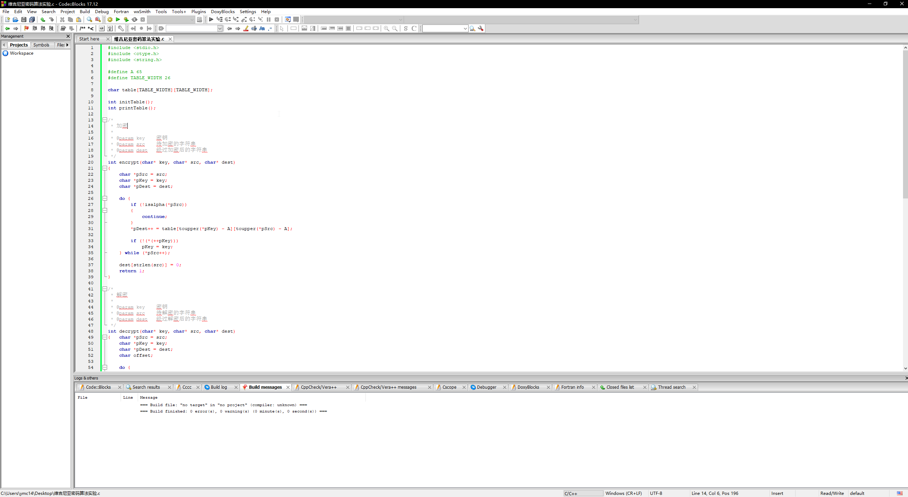
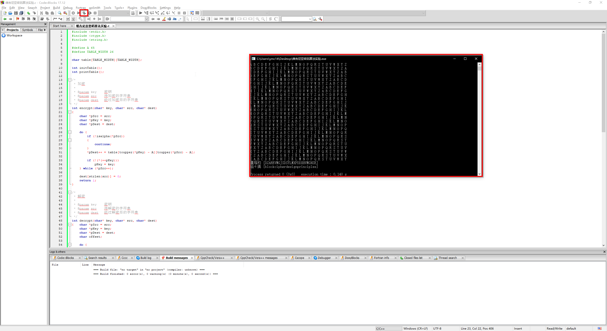

## 使用任意语言实现维吉尼亚密码加解密

### 【目的】
 实现维吉尼亚密码加解密

### 【环境】
- 操作机：Ubuntu-crypto
- 密码：toor
- 参考代码存放位置：\Home\crypto\Documents\course

### 【工具】
- Sublime Text
- gcc

### 【原理】
- 维吉尼亚密码（又译维热纳尔密码）是使用一系列凯撒密码组成密码字母表的加密算法，属于多表密码的一种简单形式。
- 维吉尼亚密码以其简单易用而著称，同时初学者通常难以破解，因而又被称为“不可破译的密码”。这也让很多人使用维吉尼亚密码来加密的目的就是为了将其破解。
- 维吉尼亚密码以布莱斯·德·维吉尼亚的名字来命名，然而其真正的发明者是莱昂·巴蒂斯塔·阿尔伯蒂。而维吉尼亚则发明过一种更强大的自动密钥密码。
- 破译维吉尼亚密码的关键在于它的密钥是循环重复的。如果我们知道了密钥的长度，那密文就可以被看作是交织在一起的凯撒密码，而其中每一个都可以单独破解。此时，我们可以使用IC测试（也可以称为一致性索引），IC是基于凹凸度量理念。
如果字母完全平滑分布，说明密文中每个字母出现的概率相同，都为1/26。然而标准英文中字母频率分布不是平滑的，因此，凹凸度量是密文中字母实际频率与完全平滑频率（1/26）之差。

### 【实验步骤】

#### 参考代码 C
```c
#include <stdio.h>
#include <ctype.h>
#include <string.h>

#define A 65
#define TABLE_WIDTH 26

char table[TABLE_WIDTH][TABLE_WIDTH];

int initTable();
int printTable();

/*
 * 加密
 *
 * @param key    密钥
 * @param src    待加密的字符串
 * @param dest   经过加密后的字符串
 */
int encrypt(char* key, char* src, char* dest)
{
	char *pSrc = src;
	char *pKey = key;
	char *pDest = dest;

	do {
		if (!isalpha(*pSrc))
		{
			continue;
		}
		*pDest++ = table[toupper(*pKey) - A][toupper(*pSrc) - A];

		if (!(*(++pKey)))
			pKey = key;
	} while (*pSrc++);

	dest[strlen(src)] = 0;
	return 1;
}

/*
 * 解密
 *
 * @param key    密钥
 * @param src    待解密的字符串
 * @param dest   经过解密后的字符串
 */
int decrypt(char* key, char* src, char* dest)
{	char *pSrc = src;
	char *pKey = key;
	char *pDest = dest;
	char offset;

	do {
		offset = (*pSrc) - toupper(*pKey);
		offset = offset >= 0 ? offset : offset + TABLE_WIDTH;
		*pDest++ = tolower(A + offset);

		if (!(*(++pKey)))
			pKey = key;
	} while (*pSrc++);

	dest[strlen(src)] = 0;
	return 1;
}

int main()
{
	// 本例推算见《密码学基础》(西安电子科技大学出版社) 第5页
	char secret[256] = "computer";
	char text[256] = "block cipher design principles";
	char ciphertext[256];
	char output[256];

	// 初始化密表
	initTable();
	printTable();

	// 根据密匙加密
	encrypt(secret, text, ciphertext);
	printf("密文 [%s]\n", ciphertext);

	// 根据密匙解密
	decrypt(secret, ciphertext, output);
	printf("解密 [%s]\n", output);

	return 0;
}

/*
 * 初始化维吉尼亚方阵
 */
int initTable()
{
	int i, j;
	for (i = 0; i < TABLE_WIDTH; i++)   {
		for (j = 0; j < TABLE_WIDTH; j++)    {
			table[i][j] = A + (i + j) % TABLE_WIDTH;
		}
	}
	return 1;
}

int printTable()
{
	int i, j;
	for (i = 0; i < TABLE_WIDTH; i++)   {
		for (j = 0; j < TABLE_WIDTH; j++)    {
			printf("%c ", table[i][j]);
		}
		printf("\n");
	}
	return 1;
}
```
#### 参考代码 python
```python
# -*- coding: utf-8 -*-
#
# Vigenere Cipher
# 
# @author  lellansin <lellansin@gmail.com>
# @website http://www.lellansin.com/tutorials/ciphers
#

ASC_A = ord('A')
TABLE_WIDTH = 26

# 
# 初始化密表
# 
def init_table():
    return [[chr((col + row) % TABLE_WIDTH + ASC_A) \
                     for col in range(TABLE_WIDTH)] \
                     for row in range(TABLE_WIDTH)]


# 
# 显示密表
# 
def print_table(table):
    output = ''
    for row in range(0, len(table)):
        for col in range(0, len(table[row])):
            output = output + table[row][col] + ' '
        output = output + '\n'
    print(output)


# 
# 加密
# 
def encrypt(table, key, words):
    cipher = ''
    count = 0
    key = key.upper()

    for ch in words.upper():
        if str.isalpha(str(ch)):
            key_shift  = ord(key[count % len(key)]) - ASC_A
            word_shift = ord(ch) - ASC_A
            cipher += table[key_shift][word_shift];
            count  += 1

    return cipher


# 
# 解密
# 
def decrypt(table, key, words):
    text = ''
    count = 0
    key = key.upper()
    for ch in words.upper():
        shift = ord(ch) - ord(key[count % len(key)])
        text += chr((shift + TABLE_WIDTH) % TABLE_WIDTH + ASC_A)
        count += 1
    return text.lower()


if __name__ == '__main__':
    # 本例推算见《密码学基础》(西安电子科技大学出版社) 第5页

    # 密匙
    secret = "computer";
    # 明文
    text = "block cipher design principles";

    # 初始化密表
    table = init_table()
    print_table(table)
    
    # 使用密表加密字符串
    ciphertext = encrypt(table, secret, text)
    # 输出密文
    print(ciphertext)
    # 解密字符串
    print(decrypt(table, secret, ciphertext))
```
1. 打开C语言IDE，新建一个C语言project。将案例代码拷贝到空白源文件中


2. 点击build and run，编译并运行源代码。


### 【总结】
- 通过本节实验的学习，掌握了使用任意语言实现维吉尼亚加解密的方法。