# CRYPT-2 流密码


## 知识点
- 流密码的基本概念
- 线性反馈移位寄存器
- m序列的伪随机性
- m序列密码的破译
- 非线性序列


## 学习目标
- 掌握流密码的基本概念；
- 了解常用伪随机性的评价方法；
- 掌握线性移位寄存器的结构与输出序列的伪随机性；
- 熟悉非线性序列的概念与基本产生方法；
- 掌握一种典型流密码，祖冲之密码或 RC4 密码。


## 目录
2.1 流密码的基本概念
2.2 通用伪随机数生成器（PRNG）
2.3 基于位移寄存器的流密码
2.4 非线性流密码
2.5 常见的流密码


### 2.1 流密码的基本概念
流密码的基本思想:
密钥:$k$
产生一个密钥序列：$z=z_0 z_1...z_i$
明文串：$x=x_0 x_1 x_2…x_i$
加密：$y=y_0 y_1 y_2…=E_{z_0}(x_0)E_{z_1}(x_1)E_{z_2}(x_2)…$
密钥序列发生器f：$z_i=f(k,σ_i)$
$σ_i$是加密器中的记忆元件（存储器）在时刻i的状态，f是由密钥$k$和$σ_i$产生的函数。


#### 2.1.1 二元加法流密码
二元加法流密码是目前最为常用的流密码体制，其单独加密明文的每一位。它通过将密钥序列S中的每个位与明文位进行异或（XOR）运算。
我们用 $x_i,y_i,s_i$来分别代表明文、密文和密钥序列中的每一位，$x_i,y_i,s_i∈{0,1}$

加密：$y_i=e_{s_i}$ $x_i≡x_i+s_i\space mod\space 2$
解密：$x_i=d_{s_i}$ $y_i≡y_i+s_i\space mod\space 2$


#### 2.1.2 XOR运算
逻辑运算之中，除了 AND 和 OR，还有一种 XOR 运算，中文称为“异或运算”，用符号 ⊕ 来表示。
两个值相同时，返回false（0），否则返回true（1）。XOR可以用来判断两个值是否不同。
XOR运算是模2加法，$a⊕b≡a+b\space mod\space 2$

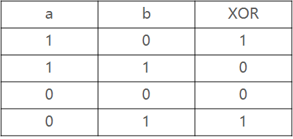

XOR有一个特点：如果对一个值连续做两次 XOR，会返回这个**值本身**。

第一次XOR：𝟏𝟎𝟏𝟎⊕𝟏𝟏𝟏𝟏=𝟎𝟏𝟎𝟏
第二次XOR：𝟎𝟏𝟎𝟏⊕𝟏𝟏𝟏𝟏=𝟏𝟎𝟏𝟎

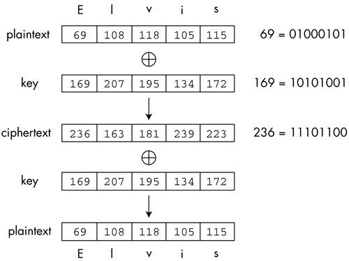


#### 2.1.3 密钥序列
密钥序列的生成是流密码安全性的核心问题，它决定了流密码的安全性。为了让攻击者无法对序列进行猜测，那密钥序列看上去应该是随机的，也就是随机生成数字。


#### 2.1.4 随机数

**随机数与伪随机数**
- 真正的随机数是使用物理现象产生的：比如掷钱币、骰子、转轮、使用电子元件的噪音、核裂变等等，这样的随机数发生器叫做物理性随机数发生器，它们的缺点是技术要求比较高。
- 使用计算机产生真随机数的方法是获取cpu频率与温度的不确定性以及统计一段时间的运算次数每次都会产生不同的值，系统时间的误差以及声卡的底噪等。
- 在实际应用中往往使用伪随机数就足够了。这些数列是“似乎”随机的数，实际上它们是通过一个固定的、可以重复的计算方法产生的。计算机或计算器产生的随机数有很长的周期性。它们不真正地随机，因为它们实际上是可以计算出来的，但是它们具有类似于随机数的统计特征。这样的发生器叫做伪随机数发生器。

**随机数的随机性检验可以分为三个标准：**

- 统计学伪随机性。统计学伪随机性指的是在给定的随机比特流样本中，1的数量大致等于0的数量，同理，“10”“01”“00”“11”四者数量大致相等。类似的标准被称为统计学随机性。满足这类要求的数字在人类“一眼看上去”是随机的。
- 密码学安全伪随机性。其定义为，给定随机样本的一部分和随机算法，不能有效的演算出随机样本的剩余部分。
- 真随机性。其定义为随机样本不可重现。实际上只要给定边界条件，真随机数并不存在，可是如果产生一个真随机数样本的边界条件十分复杂且难以捕捉（比如计算机当地的本底辐射波动值），可以认为用这个方法演算出来了真随机数。


#### 2.1.5 OTP一次性密码本

一次性密码本（one-time pad，缩写为OTP）是古典密码学中的一种加密算法。是以随机的密钥（key）组成明文，且只使用一次。
在理论上，此种密码具有完善保密性，是牢不可破的。它的安全性已由克劳德·艾尔伍德·香农所证明。要使用一次性密码本，必须满足一下条件：
- 通过真随机数生成密钥序列
- 每个密钥序列位都只使用一次，也就是和明文等长
- 只有合法的通信方才知道密钥序列，使用后立即销毁

**为什么无法破译**

这里的无法破译指的不是无法暴力破解，而是无法确认破破译后的正确性。

**为什么没有被广泛使用**

- 最大问题在于密钥的配送
- 密钥的保存
- 密钥的同步
- 密钥的生成

### 2.2 通用伪随机数生成器（PRNG）

伪随机数生成器从一个初始种子值开始通过各种计算得到序列。通常伪随机数序列是递归地执行以下计算得到的：

$$S_0=seed$$

$$S_i+1\equiv f(S_i),i=0,1,...$$

此表达式的一个推广形式就是$S_{i+1}=f(s_i,s_{i-1},s_{i-2},...,s_{i-t})$所示的生成器，其中t是一个固定整数。最常见的例子就是线性同余生成器（a，b，m都是整型常量）：

$$S_0=seed$$

$$S_{i+1}\equiv (aS_i+b)\space mod\space m,i=0,1,2,...$$

许多数学测试都验证PRNG序列的统计行为（满足随机性检验标准1），也就是说它的输出近乎和真随机相同。


#### 2.2.1 破译通用伪随机数生成器（PRNG）
PRNG的输出序列非常具有随机性，那我们是否可以用它来生成我们的密钥序列呢？答案是不能，已知明文攻击可以轻松算出PRNG的参数，从而对加密后的明文进行破解。
定义一个线性同余发生器：

$$S_0=seed$$

$$S_{i+1}\equiv (aS_i+b)\space mod\space m,i=0,1,2,...$$

其中，m为100位长， $S_i$,A,B∈{0,1,2,⋯,m−1}。模数m是加密方案的一部分，是公开已知的。密钥包含（A,B）以及种子𝑆_0，每个值得长度均为100位。此时，密钥长度为200位，可以抵挡暴力攻击。
若有一段明文 X，加密后的密文为 Y， $x_i$为明文 X 的二进制表示的位， $s_i$为PRNG输出的$S_i$的二进制表示的位。加密表达式为：

$$y_i\equiv (x_i+s_i)\space mod\space 2$$

根据之前仿射密码破译的经验，我们尝试使用已知明文攻击。
假如现在通过猜测或者是文件固有的头文件信息，得到了明文的前300位（300/8=37.5个字节），那么我们可以利用以下表达式计算密钥序列的前300位：

$$s_i\equiv (y_i+x_i)\space mod\space m ,i=1,2,...,300$$

因为m的长度为100，那么我们可以得出PRNG的前三个输出符号：$S_1=\{s_1,s_2,...,s_{100}\}$了，$S_2\{s_{101},s_{102},...,s_{200}\}$和$S_3=\{s_{201},s_{202},...,s_{300}\}$，得到两组等式：

$$S_2=(AS_1+B)\space mod\space m$$

$$S_3=(AS_2+B)\space mod\space m$$

这是一个基于$Z_m$的线性等式系统，拥有两个未知数A和B。但是两个值都是密钥，我们可以立即求解该系统，得到：

$$A\equiv \frac{S_2=S_3}{S_1-S_2}\space mod\space m$$

$$B\equiv \frac{S_1(S_2-S_3)}{S_1-S_2}\space mod\space m$$

在$gcd((S_1-S_2),m\not=1)$的情况下可以得到多个解，因为这个等式系统基于 $Z_m$。然而，在大多数情况下，如果得到已知明文的第四片消息，就可以唯一地检测出密钥。

**例题：**
假设窃密者得到密文串101101011110010和相应的明文串011001111111001，得密钥流为110100100001011。进一步假定窃密者还知道密钥流是使用5级线性反馈移位寄存器产生的，那么窃密者可分别用密文串中的前10个比特和明文串中的前10个比特建立如下方程：

$$
(a_6\space a_7\space a_8\space a_9\space a_{10})=(c_5\space c_4\space c_3\space c_2\space c_1)
\left\{
\begin{matrix}
a_1& a_2& a_3& a_4& a_5 \\
a_2& a_3& a_4& a_5& a_6 \\
a_3& a_4& a_5& a_6& a_7 \\
a_4& a_5& a_6& a_7& a_8 \\
a_5& a_6& a_7& a_8& a_9
\end{matrix}
\right\}
$$


$$
(0\space 1\space 0\space 0\space 0)=\space (c_5\space c_4\space c_3\space c_2\space c_1)
\left\{
\begin{matrix}
1&1&0&1&0 \\
1&0&1&0&0 \\
0&1&0&0&1 \\
1&0&0&1&0 \\
0&0&1&0&0
\end{matrix}
\right\}
$$

$$
\left\{
\begin{matrix}
1&1&0&1&0 \\
1&0&1&0&0 \\
0&1&0&0&1 \\
1&0&0&1&0 \\
0&0&1&0&0
\end{matrix}
\right\}^{-1}=
\left\{
\begin{matrix}
0&1&0&0&1 \\
1&0&0&1&0 \\
0&0&0&0&1 \\
0&1&0&1&1 \\
1&0&1&1&0
\end{matrix}
\right\}
$$


$$
(C_5\space C_4\space C_3\space C_2\space C_1)=(0\space1\space0\space0\space0)
\left\{
\begin{matrix}
0&1&0&0&1 \\
1&0&0&1&0 \\
0&0&0&0&1 \\
0&1&0&1&1 \\
1&0&1&1&0
\end{matrix}
\right\}
$$

$$
(C_5\space C_4\space C_3\space C_2\space C_1)=(1\space 0\space0\space1\space0)
$$

$$a_{i+5}=c_5a_i\oplus c_2a_{i+3}=a_i\oplus a_{i+3}$$


### 2.3 基于位移寄存器的流密码
#### 2.3.1 线性反馈移位寄存器（LFSR）
一个LFSR由若干时钟存储原件（触发器）和一个反馈路径（有多种情况，但只能选择使用一种）组成。存储原件的数目给出了LFSR的度。一个拥有m个触发器的LFSR可以称为“度为m”。在每个时钟周期内，内部状态位会右移一位，并执行XOR计算。
以度m=3为例，此时LFSR有三个触发器FF0，FF1，FF2初始状态s_0,𝑠_1,𝑠_2，以及如图的反馈路径。工作方式如下：


#### 2.3.1 线性反馈移位寄存器（LFSR）

用一个简单的公式来表示这个LFSR的功能：

$$s_3\equiv (s_1+s_0\space) mod\space 2$$

$$s_4\equiv (s_2+s_1\space) mod\space 2$$

$$s_5\equiv (s_3+s_2\space) mod\space 2$$

$$⋮$$

$$s_{i+3}\equiv (s_{i+1}+s_i\space) mod\space 2$$

当然，这只是在m=3的情况下成立的，接下来看一下通用的LFSR


如图显示了一个度为m的LFSR的通用形式。此LFSR拥有m个触发器和m个可能的反馈位置。反馈路径是否启用取决于反馈系数 $p_0,p_1,p_2,...,p_{m-1}$；
如果$p_i=1$（启用路径），对应触发器输出的值加入XOR运算
如果$p_i=0$（中断路径），对应触发器输出的值不会加入XOR运算


假设某个LFSR初始加载的值为$s_0,s_1,...,s_{m-1}$，则LFSR的下一个输出位$s_m$可以表示为：

$$s_m\equiv (s_{m-1}p_{m-1}+...+s_1p_1+s_0p_0)\space mod\space 2$$

同理可推得下一个LFSR输出的计算式：

$$s_{i+m}\equiv \sum^{m-1}_{j=0}p_j\times s_{i+j}\space mod\space 2;s_i,p_j\in\{0,1\};i=0,1,2,...$$

线性反馈移位寄存器因其实现简单、速度快、有较为成熟的理论等优点而成为构造密钥流生成器的最重要的部件之一。

由于可重复性出现状态的数量有限，所以LFSR的输出序列会周期性重复。并且LFSR可以根据反馈系数的生成不同长度的输出序列，LFSR的最大长度与其度m有关：$2^m−1$
只有设置特定的$(p_0,p_1,...,p_{m-1})$才能得到最大长度的LFSR。
例如：同样度m=4
（1）反馈路径为$(p_3=0,p_2=0,p_1=1,p_0=1)$的LFSR，输出序列的周期为$2^4-1=15$
（2）反馈路径为$(p_3=1,p_2=1,p_1=1,p_0=1)$的LFSR，输出序列的周期为5

每个LFSR有一个关联多项式，它与决定下一个移入位的函数不同。该多项式与LFSR的数学结果相关。特征式为：

$$p(x)=p_nx^n+p_{n-1}x^{n-1}+...+p_ix+1$$

如果$p_i$位的路径打开，那么$p_i=1$，否则为0。
事实证明，如果LFSR的特征多项式是不可约分的，那么LFSR就有一个最大的序列。如果不能约分了，且将$p(x)$分为$x^k-1$的最小整数k为$2^n-1$，那么多项式的次数n、 𝑝(𝑥)是基本的。

在线性反馈移位寄存器中总是假定$p_0,p_1,...,p_{m-1}$中至少有一个不为0，否则$s_{i+m}\equiv 0$，这样的话，在n个脉冲后状态必然是00…0，且这个状态必将一直持续下去。
若只有一个系数不为0，设仅有$p_i$为1，实际上是一种延迟装置。
一般对于m级线性反馈移位寄存器，总是假定$p_i=1$。

流密码的安全性取决于密钥流的安全性，要求密钥流序列有好的随机性，以使密码分析者对它无法预测。也就是说，即使截获其中一段，也无法推测后面是什么。如果密钥流是周期的，要完全做到随机性是困难的。严格地说，这样的序列不可能做到随机，只能要求截获比周期短的一段时不会泄
露更多信息，这样的序列称为伪随机序列。


#### 课堂演示
**在CAP4软件中实现LFSR**

CAP提供的流加密法也是基于一个LFSR的，你必须输入移位寄存器的大小（但是必须是4的倍数）。然后输入移位寄存器的初始值（十六进制的数）。反馈系数决定了那些寄存器的单元将参与XOR运算以生成输出位。

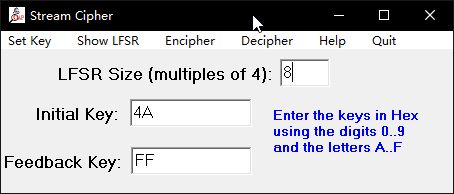

CAP的另外一个功能Show LFDR可以图形化显示LFSR的触发器和反馈路径。
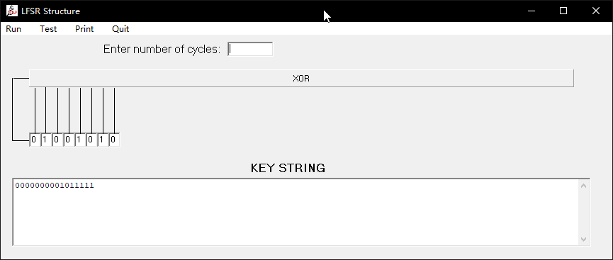


#### 2.3.2 破译LFSR流密码
由于LFSR是线性关系，由其输入输出之间的线性关系来决定。然而在密码体制中，线性关系会使密钥变得非常不安全，已知明文攻击通过求解可以对其进行破译。
假设攻击者已知一段长度为2m的明文$x_0,x_1,x_2,⋯,x_(2m-1)$，它对应的密文$y_0,y_1,y_2,⋯y_(2m-1)$，此时攻击者可以重构开头的2m个密钥序列：

$$s_i\equiv x_i+y_i\space mod \space 2;i=0,1,2,...,2m-1$$

由于每个 i 值都会生成不同的等式，因此我们可以得到 i 个等式：

$$i=0,\space s_m\equiv s_{m-1}p_{m-1}+...+s_1p_1+s_0p_0\space mod2$$

$$i=1,\space s_{m+1}\equiv s_mp_{m-1}+...+s_2p_1+s_1p_0\space mod2$$

$$i=2,\space s_{m+2}\equiv s_{m+1}p_{m-1}+...+s_3p_1+s_2p_0\space mod2$$

$$⋮$$

$$i=m-1,\space s_{2m-2}p_{m-1}+...+s_mp_1+s_{m-1}p_0 \space mod2$$

对于这个等式，可以使用高斯消去法、矩阵求逆或其他方法来求解此线性等式系统。即使m的值非常大，现代计算机仍然能够在较短时间计算求解。
当然这并不代表LFSR无法应用到密码体系中去，我们可以通过使用多个LFSR进行组合，构建一个健壮的密码体制。


### 2.4 非线性流密码
**非线性密钥流生成器可分解为驱动子系统和非线性组合子系统**
- 驱动子系统常用一个或多个线性反馈移位寄存器来实现
- 非线性组合子系统用非线性组合函数F来实现

为了使密钥流生成器输出的二元序列尽可能复杂，应保证其周期尽可能大、线性复杂度和不可预测性尽可能高，因此常使用多个LFSR来构造二元序列，称每个LFSR的输出序列为驱动序列，显然密钥流生成器输出序列的周期不大于各驱动序列周期的乘积，因此，提高输出序列的线性复杂度应从极大化其周期开始。
二元序列的线性复杂度指生成该序列的最短LFSR的级数，最短LFSR的特征多项式称为二元序列的极小特征多项式。

#### 2.4.1 Geffe 序列生成器
Geffe序列生成器由3个LFSR组成，其中LFSR2作为控制生成器使用

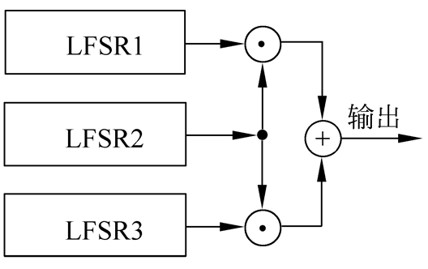

当LFSR2输出1时，LFSR2与LFSR1相连接；当LFSR2输出0时，LFSR2与LFSR3相连接。
若设LFSRi的输出序列为$\{a^{(i)}_k\} (i=1,2,3)$，则输出序列{$b_k$}可以表示为

$$b_k=a_k^{(1)}a_k^{(2)}+a_k^{(3)}\overline{a_k^{(2)}}=a_k^{(1)}a_k^{(2)}+a_k^{(3)}a_k^{(2)}+a_k^{(3)}$$

Geffe序列生成器也可以表示为图2.13的形式，其中LFSR1和LFSR3作为多路复合器的输入，LFSR2控制多路复合器的输出。设LFSRi的特征多项式分别为ni次本原多项式，且ni两两互素，则Geffe序列的周期为

$$\prod ^{3}_{i=1}(2^{n_i}-1)$$

线性复杂度为

$$(n_1+n_3)n_2+n_3$$

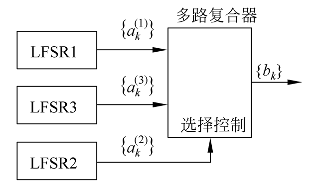

Geffe序列的周期实现了极大化，且0与1之间的分布大体上是平衡的。


#### 2.4.2 J-K触发器

J-K触发器如图所示，它的两个输入端分别用$J(x_1)$和$K(x_2)$表示，其输出$c_k$不仅依赖于输入，还依赖于前一个输出位$c_{k-1}$，即

$$c_k=\overline{(x_1+x_2)}\space c_{k-1}+x_1$$

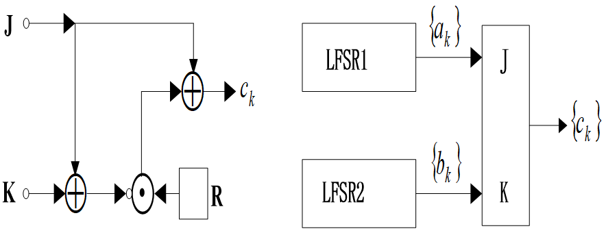

在图2.15中，令驱动序列{$a_k$}和{$b_k$}的度分别为m、n，则有

$$c_k=\overline{a_k+b_k}\space c_{k-1}+a_k=(a_k+b_k+1)c_{k-1}+a_k$$

如果令$c_{-1}=0$，则输出序列的最初3项为

当m与n互素且a0+b0=1时，序列{ck}的周期为：(2m-1)(2n-1)

若：m=2, n=3，两个驱动m序列分别为
${a_k}=0,1,1,…$
${b_k}=1,0,0,1,0,1,1,…$
于是，输出序列${c_k}$是
0,1,1,0,1,0,0,1,1,1,0,1,0,1,0,0,1,0,0,1,0,…,
其周期为$(2^2-1)(2^3-1)=21$

由表达式$𝑐_𝑘=(𝑎_𝑘+𝑏_𝑘)\cdot 𝑐_{𝑘−1}+𝑎_𝑘$可得
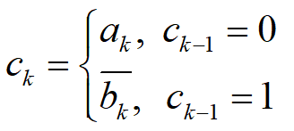
因此，如果知道${c_k}$中相邻位的值$c_{k-1}$和$c_k$，就可以推断出$a_k$和$b_k$中的一个。而一旦知道足够多的这类信息，就可通过密码分析的方法得到序列${a_k}$和${b_k}$。为了克服上述缺点，Pless 提出了由多个J-K触发器序列驱动的多路复合序列方案，称为Pless 生成器。

#### 2.4.3 Pless生成器

Pless生成器由8个LFSR、4个J-K触发器和1个循环计数器构成，由循环计数器进行选通控制，假定在时刻t输出第t(mod 4)个单元，则输出序列为
a0b1c2d3a4b5d6

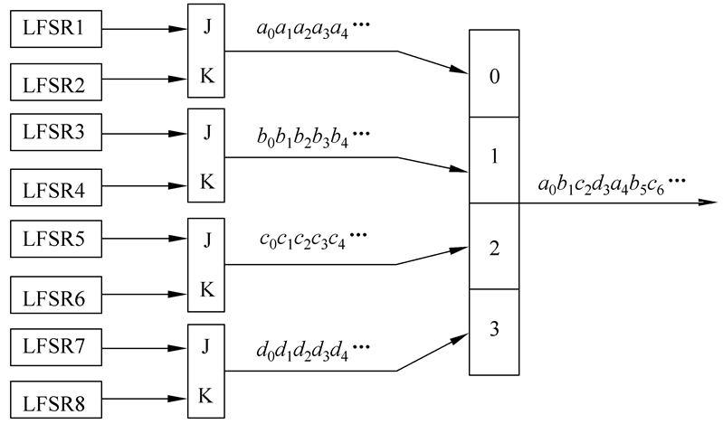


#### 2.4.4 钟控序列生成器

钟控序列最基本的模型是用一个LFSR控制另外一个LFSR的移位时钟脉冲，如图所示。


假设LFSR1和LFSR2分别输出序列{ak}和{bk}，其周期分别为p1和p2。当LFSR1输出1时，移位时钟脉冲通过与门使LFSR2进行一次移位，从而生成下一位。当LFSR1输出0时，移位时钟脉冲无法通过与门影响LFSR2。因此LFSR2重复输出前一位。假设钟控序列{ck}的周期为p，可得如下关系：

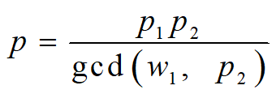

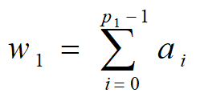

又设{ak}和{bk}的极小特征多项式分别为GF(2)上的m和n次本原多项式f1(x)和f2(x)，且m|n。因此，p1=2m-1, p2=2n-1。又知w1=2m-1， 因此
gcd(w1, p2)=1，所以p=p1p2=(2m-1)(2n-1)。
此外，也可推导出{ck}的线性复杂度为n(2m-1)，极小特征多项式为


#### 2.4.5 Trivium算法
Trivium算法是一种对称密钥同步序列密码算法。它的设计目的是在计算能力有限的硬件上高效实现安全加密，同时兼顾软件实现效率。
Trivium的标准输入为一个80位的密码和一个80位的起始向量（IV）。和大部分同步序列密码算法一样，Trivium的核心组件是一个密码学安全的伪随机数生成器（CSPRNG）。通过将密码和起始向量加载到该伪随机数生成器中，Trivium算法将计算出所需的密钥流。然后，通过将明文位依次与密文位进行异或操作，计算并输出密文。
Trivium伪随机数生成器可以看作由三个线性反馈移位寄存器组成。它们的长度分别是93、84和111位。寄存器和寄存器之间通过非线性逻辑连接。

寄存器A、B、C的长度分别为：93、84和111位，加密过程分为两个阶段：
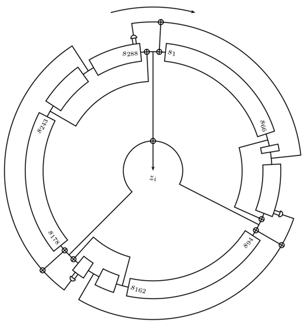

**第一阶段：**

- 将80位的密钥加载到寄存器A的左边，并将寄存器A的剩余位以0填充。
- 将80位的IV加载到寄存器B的左边，并将寄存器B的剩余位以0填充。
- 将寄存器C的最后三位以1填充，并将寄存器C的剩余位以0填充。
- 重复1152次“下一状态算法”中的操作，同时并不输出密钥。

**第二阶段：**

使用Xi表示上一状态的第X个寄存器中的第i位，使用Xi表示当前状态的第X个寄存器中的第i位，使用i ^ j表示i 、j 两位的逻辑异或，使用 i & j表示 i、j 两位的逻辑与，使用:=表示赋值。各个寄存器的第一位以1标记。s表示密钥流。
"s:=s+((C109&C110)^C111^C66)^((A91&A92)^A93^A66)^((B82&B83)^B84^B69)"
将所有寄存器向右移1位,丢弃最后一位,并将空出的首位按照下述规则填充:
"A1:=A69^((C109&C110)^C111^C66)"
"B1:=B78^((A91&A92)^A93^A66)"
"C1:=C87^((B82&B83)^B84^B69)"

### 2.5 常见的流密码
#### 2.5.1 A5/1
A5 / 1是用于在GSM蜂窝电话标准中提供无线通信隐私的流密码。它是为GSM使用指定的七种算法之一。最初是保密的，但通过泄漏和逆向工程成为公众的知识。 密码中存在一些严重的弱点。
A5/1算法使用3个线性反馈移位寄存器，简称为LFSR。三个寄存器的分别为19位、22位、23位。这里要使用三个共包含64位二进制的线性反馈移位寄存器，这个设计绝非偶然。A5/1算法的密钥K也是64位。该密钥用于三个线性反馈移位寄存器的初始填充，也就是说，该密钥用于充当三个寄存器的初始值。这三个寄存器用密钥填充之后，就可以开始生成密钥流了。

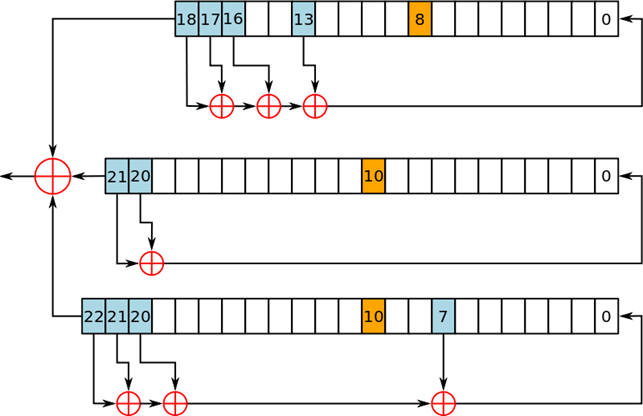

A5 / 1流密码使用三个LFSR。如果一个寄存器的时钟位（橙色）与其他两个寄存器中的一个或两个的时钟位一致，则该寄存器会被时钟控制。

A5 / 1的每个回合步骤可以拆分为：取KEY，反馈多项式（Feedback Polynomial），位移
1. 取Key：
取三个寄存器的最后一位，也就是19位、22位、23位，进行XOR操作，得到的结果为这一轮Key的一位。
2. 反馈多项式（Feedback Polynomial）：
LFSR进行位移的前置操作，具体可以分成两步：判定是否需要进行位移，判定新的充填的值。
判定是否需要进行位移：
这里使用的是择多原则，三个寄存器中选择三个钟控信号，19位中的第8位，22位，23位中皆为第10位，两种二进制0,1，必定有0或1数量居多，居多的寄存器需要进行位移操作。
判定新的充填的值：
这里需要用到反馈多项式：
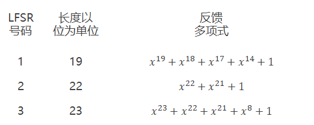
XOR后得到的值是充填到第0位的值。
3. 位移：
三个寄存器，由上一步的判定后进行位移，空出第0位用于充填反馈多项式得到的值。

**A5/1的安全性**
在欧洲和美国使用A5 / 1 。A5 / 2是对某些出口地区的算法的有意削弱。A5 / 1是在1987年开发的，当时GSM尚未考虑在欧洲以外使用，而A5 / 2是在1989年开发的。虽然两者最初都保密，但总体设计在1994年泄露，算法完全在1999年由Marc Briceno从GSM电话机中逆向工程。2000年，大约1.3亿GSM客户依靠A5 / 1来保护其语音通信的机密性; 到2014年为72亿。
爱德华斯诺登在2013年泄露的文件称，NSA“可以处理加密的A5 / 1”。


#### 2.5.2 RC4算法
在密码学中，RC4（来自Rivest Cipher 4的缩写）是一种流加密算法，RC4是有线等效加密（WEP）中采用的加密算法，也曾经是TLS可采用的算法之一。
由美国密码学家罗纳德·李维斯特（Ronald Rivest）在1987年设计的。由于RC4算法存在弱点，2015年2月所发布的 RFC 7465 规定禁止在TLS中使用RC4加密算法。
RC4由伪随机数生成器和异或运算组成。RC4的密钥长度可变，范围是[1,255]。RC4一个字节一个字节地加解密。给定一个密钥，伪随机数生成器接受密钥并产生一个S盒。S盒用来加密数据，而且在加密过程中S盒会变化。
RC4开始时是商业密码，没有公开发表出来，但是在1994年9月份的时候，它被人匿名公开在了Cypherpunks 邮件列表上，很快它就被发到了sci.crypt 新闻组上，随后从这传播到了互联网的许多站点。随之贴出的代码后来被证明是真实的，因为它的输出跟取得了RC4版权的私有软件的输出是完全相同的。由于算法已经公开，RC4也就不再是商业秘密了，只是它的名字“RC4”仍然是一个注册商标。

密钥序列由两部分算法生成：

- 密钥调度算法（KSA）
密钥调度算法被用于初始化“S”盒，“密钥长度”被定义为密钥中的字节数，并且可以在1≤keylength≤256的范围内，通常在5和16比特之间，对应于密钥长度为40-128 位。

- 初始化长度为256的S盒。第一个for循环将0到255的互不重复的元素装入S盒。第二个for循环根据密钥打乱S盒。

```c
for i from 0 to 255
      S[i] := i
end for
j := 0

for( i=0 ; i<256 ; i++)
       j := (j + S[i] + key[i mod keylength]) % 256
       swap values of S[i] and S[j]
end for

```
下面i,j是两个指针。每收到一个字节，就进行while循环。通过一定的算法$((a),(b))$定位S盒中的一个元素，并与输入字节异或，得到k。循环中还改变了S盒$((c))$。如果输入的是明文，输出的就是密文；如果输入的是密文，输出的就是明文。

```c
i := 0
j := 0

while GeneratingOutput:
     i := (i + 1) mod 256   //a
     j := (j + S[i]) mod 256 //b
     swap values of S[i] and S[j]  //c
     k := inputByte ^ S[(S[i] + S[j]) % 256]
     output K
endwhile

```

#### 2.5.4 破译RC4算法

CR4被广泛用于常用协议中，包括有线等效保密（WEP），用于无线网络的安全算法，以及HTTPS的安全套接字层（SSL）和传输层安全（TLS）协议；事实上，在所有TLS流量中，约有50%的流量目前在使用RC4算法来保护。
一个256位的RC4密码共有256！种可能，即$2^{1600}$ 种可能，这样就使得穷举攻击变得不可能。
但是RC4算法不可能从根本上模拟随机数，因此仍然存在一定的弱点。例如在第一阶段KSA中，KSA永远不会生成某类密钥，例如：$j=j+1$与$S(j)=1$。事实证明这类密钥的数量是所有可能密钥数的2^(−2n)。在256位中（28），就是256/2^16  。
40比特的RC4密码曾被广泛使用在WEP中，然而攻击者通过已知明文攻击，借助字典在几分钟之内进行快速破解。


#### 2.5.5 祖冲之密码算法
祖冲之算法集（ZUC算法）是由我国学者自主设计的加密和完整性算法，包括祖冲之算法、加密算法128-EEA3和完整性算法128-EIA3。ZUC算法由3个基本部分组成，依次为:1、比特重组；2、非线性函数F；3、线性反馈移位寄存器(LFSR)。
应用领域：4G无线通信、新一代宽带无线移动通信系统（LTE）国际标准
在2011年9月19日至21日日本福岗召开的第53次第三代合作伙伴计划（3GPP）系统架构组（SA）会议上，我国祖冲之密码算法（ZUC）被批准成为新一代宽带无线移动通信系统（LTE）国际标准。这是我国商用密码算法首次走出国门参与国际标准竞争，并取得重大突破。


### 小结
流密码的算法可以分成两种：
- 针对软件设计：CR4、SEAL等
- 针对硬件设计：基于LFSR算法的A5/1、A5/2、Trivium等
在过去的许多年里，许多流密码已经被认为安全性未知，在一些安全性要求比较高的地方不适合使用。
但流密码仍然具有很多天然优势，尤其是一些存储空间有限、功耗要求苛刻、性能羸弱的硬件应用程序中，流密码仍然被广泛使用。
即使一个伪随机数生成器生成的随机数具有良好的统计学属性，但不一定适用于加密。

### Thanks for Watching