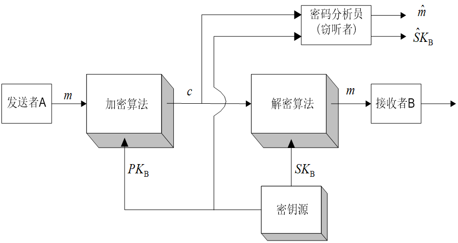
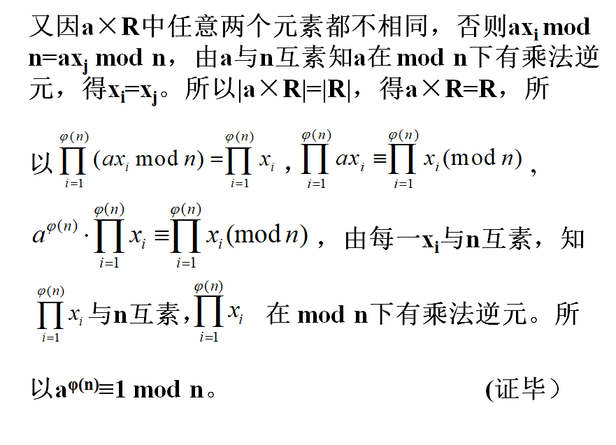
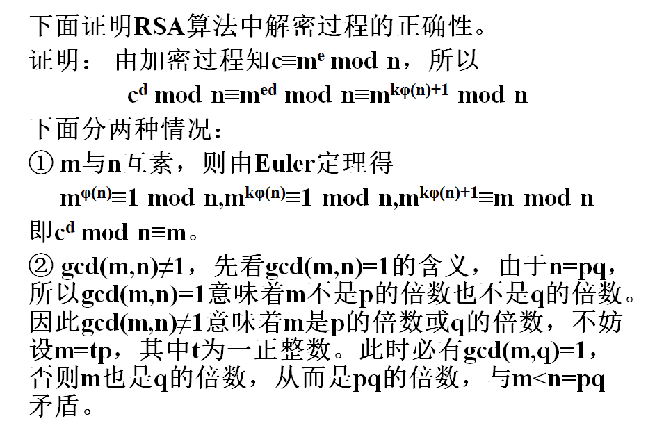
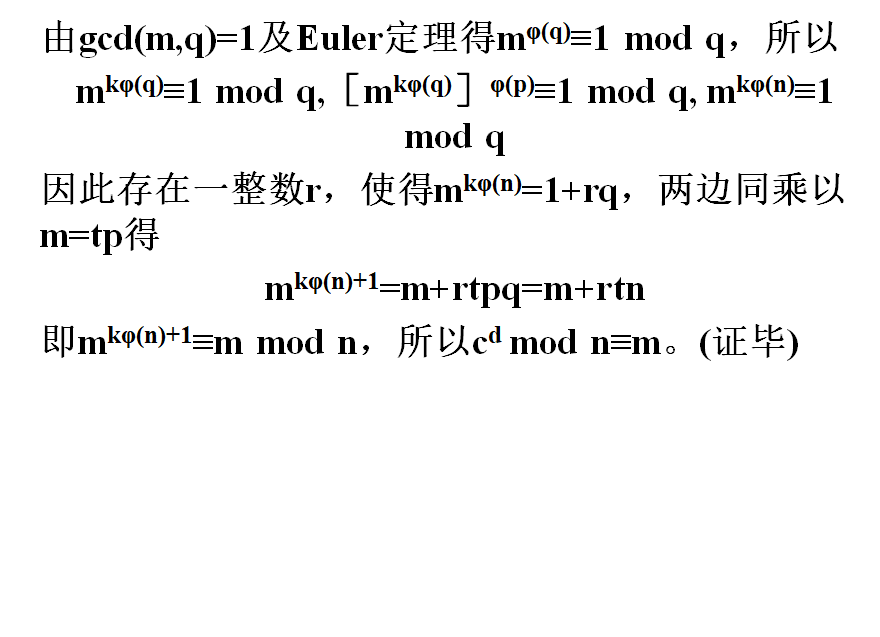
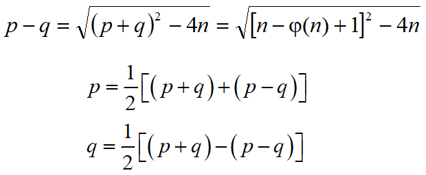
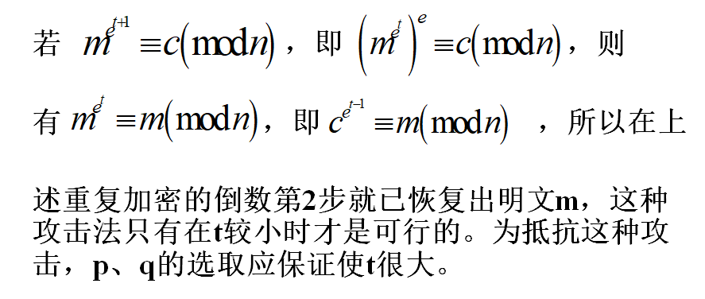
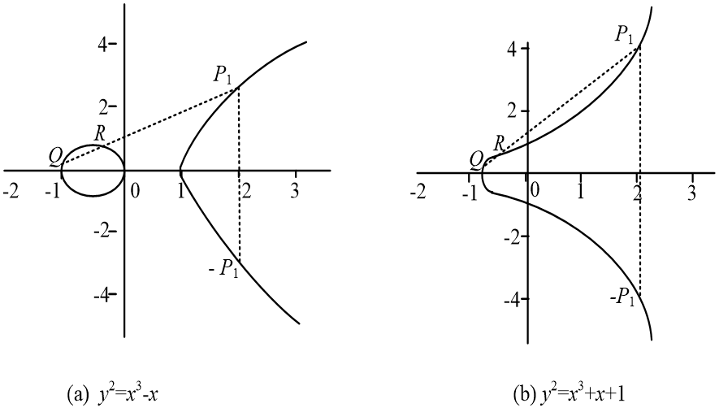
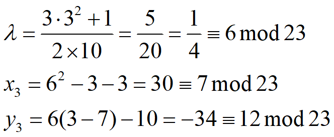

# CRYPTOGRAPHY 密码学
## CRYPT-4 公钥密码

### 目录
4.1  公钥密码体制的基本概念
4.2  公钥密码中的数学知识
4.3  RSA密码体制
4.4  基于离散对数的密码体制
4.5  椭圆曲线密码体制


### 4.1  公钥密码体制的基本概念

#### 4.1.1  对称密码与非对称密码
非对称密码与诸如AES或DES的对称算法完全不同。绝对大多数公钥算法都是基于数论函数，这点与对称密码大不相同——对称密码的目标通常是让输入与输出之间不存在紧凑的数学描述关系。尽管人们常用数学结构来描述对称密码内的小型分组，比如AES中的S-盒，但这并不意味着整个密码形成了一个紧凑的数学描述。

在公钥密码体制以前的整个密码学史中，所有的密码算法，包括原始手工计算的、由机械设备实现的以及由计算机实现的，都是基于代换和置换这两个基本工具。而公钥密码体制则为密码学的发展提供了新的理论和技术基础，一方面公钥密码算法的基本工具不再是代换和置换，而是数学函数；另一方面公钥密码算法是以非对称的形式使用两个密钥，两个密钥的使用对保密性、密钥分配、认证等都有着深刻的意义。可以说公钥密码体制的出现在密码学史上是一个最大的而且是惟一真正的革命。


#### 4.1.2 对称密码的一些缺点
- 密钥分配问题：通信双方必须使用信道传输密钥，但是通信信道是不安全的，所以直接在信道上传输密钥这种最简单的密钥分配方式是不可取的。
- 密钥个数：即使解决了密钥分配问题，我们仍然需要保存和处理大量密钥。在一个拥有n个用户的网路中，如果每对用户之间都需要一个单独的密钥对，那么网络上的密钥对个数会变成：$\frac {n*(n-1)}{2}$ 。
- 缺少对欺骗行为的防御机制。由于通信双方的密钥相同，任意一方都可以伪造另外一方的信息或否认自己发送的信息。


#### 4.1.3 公钥密码解决的问题
公钥密码体制的概念是在解决单钥密码体制中最难解决的这两个问题时提出的。
- 单钥密码体制在进行密钥分配时, 要求通信双方或者已经有一个共享的密钥，或者可籍助于一个密钥分配中心。对第一个要求，常常可用人工方式传送双方最初共享的密钥，这种方法成本很高，而且还完全依赖信使的可靠性。第二个要求则完全依赖于密钥分配中心的可靠性。
- 第二个问题数字签字考虑的是如何为数字化的消息或文件提供一种类似于为书面文件手书签字的方法。

1976年W.Diffie和M.Hellman对解决上述两个问题有了突破，从而提出了公钥密码体制。


#### 4.1.4 公钥密码体制的原理
公钥密码算法的最大特点是采用两个相关密钥将加密和解密能力分开，其中一个密钥是公开的，称为公开密钥，简称公开钥，用于加密；另一个密钥是为用户专用，因而是保密的，称为秘密密钥，简称秘密钥，用于解密。因此公钥密码体制也称为双钥密码体制。算法有以下重要特性：
已知密码算法和加密密钥，求解密密钥在计算上是不可行的。


#### 4.1.4 公钥密码体制的原理


<center>公钥体制加密的框图</center>


#### 4.1.4 公钥密码体制的原理
加密过程有以下几步：
- 要求接收消息的端系统，产生一对用来加密和解密的密钥，如图中的接收者B，产生一对密钥$PK_B$，$SK_B$，其中$PK_B$是公开钥，$SK_B$是秘密钥。
- 端系统B将加密密钥（如上图中的$PK_B$）予以公开。另一密钥则被保密（图中的$SK_B$）。
- A要想向B发送消息m，则使用B的公开钥加密m，表示为$c=E_{PKB}[m]$,其中c是密文，E是加密算法。
- B收到密文c后，用自己的秘密钥$SK_B$解密，表示为$m=D_{SKB}[c]$，其中D是解密算法。


### 4.2  公钥密码中的数学知识

#### 4.2.1 公钥密码体制算法条件
1 产生一对密钥是计算可行的
2 已知公钥、明文，产生密文是计算可行的
3 利用私钥、密文，得到明文是计算可行的
4 利用公钥来推断私钥是计算不可行的
5 利用公钥、密文，得到明文是计算不可行的
6 加密和解密的顺序可交换(可选条件)


#### 4.2.2 单向函数
上述条件条件用数学表示即为：
- $y=f(x)$在计算上是容易的
- $x=f^{-1}(y)$在计算上是不可行的

这样的函数我们称为单向函数。

想要理解公钥密码算法，并知道什么样的算法属于单向函数，我们需要学习一些数论知识，包括欧几里得算法、欧拉函数、费马小定理、欧拉定理等。


#### 4.2.3 素数和互素数

**1. 因子**

设a，b(b≠0)是两个整数，如果存在另一整数m，使得a=mb，则称b整除a，记为b|a，且称b是a的因子。

整数具有以下性质：
① a|1，那么a=±1。
② a|b且b|a，则a=±b。
③ 对任一b (b≠0)，b|0。
④ b|g，b|h，则对任意整数m、n有b|(mg+nh)。

性质④的证明： 由b|g，b|h知，存在整数g1、h1，使得g=bg1, h=bh1所以mg+nh=mbg1+nbh1=b(mg1+nh1),因此b|(mg+nh)。

**2. 素数**

称整数p(p>1)是素数，如果p的因子只有±1，±p。任一整数a(a>1)都能惟一地分解为以下形式：
$a=p_1\cdot p_2\cdot p_3 ... p_t$

其中$p_1<p_2<…<p_t$是素数，$a_i>0 (i=1,…,t)$。例如：
$91=7\times 11$，$11011=7\times 11^2\times 13$

这一性质称为整数分解的惟一性，也可如下陈述：
设P是所有素数集合，则任意整数a (a>1)都能惟一地写成以下形式：

$a=\prod_{p\in P}{P^{a_p}}$

其中$a_{p}\geq 0$,等号右边的乘积项取所有的素数，然而大多指数项ap为0。相应地，任一正整数也可由非0指数列表表示。例如： 11011可表示为
${a_7=1, a_{11}=2, a_{13}=1}$
两数相乘等价于对应的指数相加，即由k=mn 可得：对每一素数p, $k_p=m_p+n_p$。而由a|b可得： 对每一素数p, $a_p\leq b_p$。这是因为$p_k$只能被$p_j(j\leq k)$整除。

**3. 互素数**

称c是两个整数a、b的最大公因子，如果
① c是a的因子也是b 的因子，即c是a 、 b的公因子。
② a和b的任一公因子，也是c的因子。
表示为c =gcd(a, b)。
如果gcd(a, b)=1，则称a和b互素

由于要求最大公因子为正，所以gcd(a,b)=gcd(a,-b)=gcd(-a,b)=gcd(-a,-b)。一般gcd(a,b)=gcd(|a|,|b|)。由任一非0整数能整除0，可得gcd(a,0)=|a|。如果将a，b都表示为素数的乘积，则gcd（a, b）极易确定。
例如：
$300=2^2\times 3^1\times 5^2$

$18=2^1\times 3^2$

$gcd(18,300)=2^1\times 3^1\times 5^0=6$

一般由c=gcd(a,b)可得：对每一素数p，$c_p=min(a_p,b_p)$。


#### 4.2.4 欧几里得算法

然而，对于一个大整数而言，我们很难去因式分解，欧几里得算法提供了一个更有效的算法计算gcd，这个算法基于一简单的观察，即：

$gcd(r_0,r_1)=gcd(r_0-r_1,r_1)$

其中，通常假设$r_0 >r_1$，并且两个数均为正整数。此属性的证明非常简单：假设$gcd(r_0,r_1)=g$，由于g可以同时除$r_0$和$r_1$，则可以记作$r_0=g\cdot x$和$r_1=g\cdot y$，其中$x>y$，且x和y为互素的整数，即它们没有公共因子。此外，证明（x-y）与y互素也非常简单。因此可以得到：

$gcd(r_0-r_1,r_1)=gcd(g\cdot (x-y),g\cdot y)=g$

**实例：**

假设$r_0=973$，$r_1=301$，gcd的计算方式为：

步骤|运算
--|--
$973=3\times 301+70$ |$gcd(973,301)=gcd(301,70)$
$301=4\times 70+21$  |$gcd(301,70)=gcd(70,21)$
$70=3\times 21+7$    |$gcd(70,21)=gcd(21.7)$
$21=3\times 7+0$     |$gcd(21,7)=gcd(7,0)=7$


**欧几里得算法伪代码实现**

输入：正整数$r_0$和$r_1$，且$r_0>r_1$
输出：$gcd(r_0,r_1)$
初始化：$i=1$

算法：
>do
>$i=i+1$
>$r_1=r_{i-2}\space mod\space r_{i-1}$
>while $r_i\neq 0$
>return $gcd(r_0,r_1)=r_{i-1}$

当计算到余数$r_i=0$时，此算法结束，前一轮迭代计算得到的余数就是原始问题的gcd。
即使处理非常长的数字（这些数字通常在公钥密码学中使用），欧几里得算法依然高效。迭代次数与输入操作数的位数有紧密的关系。这意味着如果一个gcd涉及的数字都是1024位，则此gcd的迭代次数就是1024乘以一个常数。几千次迭代的算法在当今PC上很容易实现。


#### 4.2.6 模运算

设n是一正整数，a是整数，如果用n除a，得商为q，余数为r，则

$a=qn+r,0\leq r\leq n,q=\lfloor \frac {a}{n}\rfloor$
$\lfloor \frac {a}{n}\rfloor$表示对$\frac {a}{n}$进行下取整
用a mod n表示余数r，则$a=\lfloor \frac {a}{n}\rfloor n+amodn$                              。
如果(a mod n)=(b mod n)，则称两整数a和b模n同余，记为a≡b mod n。称与a模n同余的数的全体为a的同余类，记为[a]，称a为这个同余类的表示元素。
注意： 如果a≡0(mod n)，则n|a。

同余有以下性质：
① 若n|(a-b)，则a≡b mod n。
② (a mod n)≡(b mod n)，则a≡b mod n。
③ a≡b mod n,则b≡a mod n。
④ a≡b mod n,b≡c mod n,则a≡c mod n。
从以上性质易知，同余类中的每一元素都可作为这个同余类的表示元素。

求余数运算（简称求余运算）a mod n将整数a映射到集合{0,1, …,n-1}，称求余运算在这个集合上的算术运算为模运算，模运算有以下性质：

① $[(a\space mod\space n)+(b\space mod\space n)] mod\space n=(a+b) mod\space n$。
② $[(a\space mod\space n)-(b\space mod\space n)] mod\space n=(a-b)\space mod\space n$。
③ $[(a\space mod\space n)×(b\space mod\space n)] mod\space n=(a×b)\space mod\space n$。


性质①的证明： 设 $a\space mod\space n=r_a$，$b\space mod\space n=r_b$，则存在整数$j$、$k$ 使得 $a=j\cdot n+r_a$，$b=k\cdot n+r_b$。

因此

$(a+b)\space mod\space n=[(j+k)n+r_a+r_b]\space mod\space n=(r_a+r_b)\space mod\space n
= [(a\space mod\space n)+(b\space mod\space n)]\space mod\space n$ （证毕）

性质②、③的证明类似。


#### 4.2.7 扩展的欧几里得算法

在讲欧几里得算法的时候我们已经知道两个整数$r_0$和$r_1$的gcd的计算可以通过不断进行迭代地减小操作数来实现。然而，事实证明，欧几里得算法的主要应用并不在计算gcd。扩展的欧几里得算法可以用来计算模逆元，而模逆元在公钥密码学中占有举重若轻的地位。拓展的欧几里得算法除了可以计算gcd外，还能计算以下形式的线性组合：

$gcd(r_0,r_1)=s\cdot r_0+t\cdot r_1$


其中s和t均表示整型系数。这个等式通常也称为丢番图方程。
这个算法的思路是：执行标准欧几里得算法，但将每轮迭代中的余数$r_i$表示为以下形式的线性组合：

$r_i=s_ir_0+t_ir_i$

如果这个过程成功了，则最后一轮迭代对应的等式为：

$r_i=gcd(r_0,r_1)=s_ir_0+t_ir_1=sr_0+tr_1$

这也意味着最后一个系数$s_i$也是等式所寻找的系数s，同时$t_i=t$。


#### 4.2.8 费马小定理和欧拉定理

**费马小定理**

定理：若p是素数，a是正整数且 $gcd(a, p)=1$，则 $a^{p-1}≡1\space mod\space p$。

若n不能整除 $a-b$，$x>0$，$(x,n)=1$，则$n$也不能整除 $x(a-b)$。A为所有小于p的集（A构成p的完全剩余系，即A 
中不存在两个数同余p），B是A中所有的元素乘以a组成的集合。因为 A中的任何两个元素之差都不能被p整除，所以B中的任何两个元素之差也不能被p整除。

换句话说， {\displaystyle gcd(a,p)=1} {\displaystyle gcd(a,p)=1}，考虑 {\displaystyle 1*a,2*a,3*a,....(p-1)*a} {\displaystyle 1*a,2*a,3*a,....(p-1)*a}共 {\displaystyle (p-1)} {\displaystyle (p-1)}个数，将它们分别除以p，余数分别为 {\displaystyle r_{1},r_{2},r_{3},....,r_{p-1}} {\displaystyle r_{1},r_{2},r_{3},....,r_{p-1}}，则集合{r1,r2,r3,...,rp-1}为集合{1,2,3,...,(p-1)}的重新排列，即1,2,3,....,(p-1)在余数中恰好各出现一次；这是因为对于任两个相异k*a而言（k=1,2,3....(p-1)），其差不是p的倍数（所以不会有相同余数），且任一个k*a亦不为p的倍数（所以余数不为0）。因此

{\displaystyle 1\cdot 2\cdot 3\cdot \dots \cdot (p-1)\equiv (1\cdot a)\cdot (2\cdot a)\cdot \dots \cdot ((p-1)\cdot a){\pmod {p}},} {\displaystyle 1\cdot 2\cdot 3\cdot \dots \cdot (p-1)\equiv (1\cdot a)\cdot (2\cdot a)\cdot \dots \cdot ((p-1)\cdot a){\pmod {p}},}
即

{\displaystyle W\equiv W\cdot a^{p-1}{\pmod {p}},} W\equiv W\cdot a^{{p-1}}{\pmod  {p}},
在这里W=1·2·3·...·(p-1)，且(W, p) = 1，因此将整个公式除以W即得到：

{\displaystyle a^{p-1}\equiv 1{\pmod {p}}} a^{{p-1}}\equiv 1{\pmod  {p}}

证明：由前面的讨论知，当 $gcd(a, p)=1$ 时,$a×z_p=z_p$，其中a×Zp表示a与Zp中每一元素做模p乘法。又知a×0≡0 mod p，所以a×Zp-{0}=Zp-{0}，a×(Zp-{0})=Zp-{0}。即
{a mod p,2a mod p,…,(p-1)a mod p}={1,2,…,p-1}


## 4.2.8 费马小定理和欧拉定理
### 费马小定理
所以：
$a×2a×…×(p-1)a≡[(a mod p)×(2a mod p)×…×$
((p-1)a mod p)] mod p≡(p-1)! mod p
另一方面
$a×2a×…×(p-1)a=(p-1)!ap-1$
因此
$(p-1)!ap-1≡(p-1)! mod p$
由于(p-1)!与p互素，因此(p-1)!有乘法逆元，由乘法可约律得$a_{p-1}\equiv 1 mod p$。（证毕）
费马小定理也可写成如下形式： 设p是素数，a是任一正整数，则$a_p\equiv a mod p$。

## 4.2.8 费马小定理和欧拉定理
### 欧拉函数
设n是一正整数，小于n且与n互素的正整数的个数称为n的欧拉函数，记为$\phi (n)$。
例如： $\phi (6)=2$ ，$\phi (7)=6$ ，$\phi (8)=4$。
若n是素数，则显然有$\phi (n)=n-1$。


## 4.2.8 费马小定理和欧拉定理
### 欧拉函数
定理: 若n是两个素数p和q的乘积，则$\phi (n)=\phi (p)× \phi (q)=(p-1)×(q-1)$。

证明：考虑$Z_n={0,1,…,pq-1}$，其中不与n互素的数有3类，$A={p,2p,…,(q-1)p}$，$B={q,2q,…,(p-1)q},C={0}$，且$A∩B=Φ$，
否则$ip=jq$，其中$1≤i≤q-1$，$1≤j≤p-1$,则$p$是$jq$的因子，因此是$j$的因子，设$j=kp$，$k≥1$。则$ip=kpq$，$i=kq$，与$1≤i≤q-1$矛盾。
所以$φ(n)=|Zn|-[|A|+|B|+|C|]=pq-[(q-1)+(p-1)+1]$
	$=(p-1)×(q-1)=φ(p)×φ(q)$            （证毕）
例如：由21=3×7，得$\phi (21)=\phi (3)× \phi (7)=2×6=12$。


## 4.2.8 费马小定理和欧拉定理
### 欧拉定理
定理：若a和n互素，则aφ(n)≡1 mod n。
证明： 设$R=\{x_1, x_2, …, x_{\phi (n)}\}$是由小于n且与n互素的全体数构成的集合，$a×R=\{ax_1\space mod\space n, ax_2\space mod\space n,…, ax_{\phi (n)}\space mod\space n\}$，对$a×R$中任一元素$ax_i\space mod\space n$，因a与n互素，$x_i$与n互素，所以$ax_i$与n互素，且$ax_i\space mod\space n < n$，因此$ax_i mod n\in R$，所以$a\times R\subseteq R$。


## 4.2.8 费马小定理和欧拉定理
### 欧拉定理



## 4.2.9 素性检验
素性检验是指对给定的数检验其是否为素数。对于大数的素性检验来说没有简单直接的方法，本节介绍一个概率检验法，为此需要以下引理。


## 4.2.9 素性检验
引理:  如果p为大于2的素数，则方程$x^2≡1(mod\space p)$的解只有x≡1和x≡-1。
证明：由$x^2≡1\space mod\space p$，有$x^2-1≡0\space mod\space p$，$(x+1)(x-1)≡0\space mod\space p$，因此$p|(x+1)$或$p|(x-1)$或 $p|(x+1)$且$p|(x-1)$。
若$p|(x+1)$且$p|(x-1)$，则存在两个整数$k$和$j$，使得$x+1=kp$，$x-1=jp$,两式相减得$2=(k-j)p$，为不可能结果。所以有$p|(x+1)$或$p|(x-1)$。
设$p|(x+1)$，则$x+1=kp$，因此$x≡-1(mod\space p)$。
类似地可得 $x≡1(mod\space p)$。（证毕）


## 4.2.9 素性检验
引理的逆否命题为：如果方程$x^2≡1\space mod\space p$有一解
$x_0 \notin {-1,1}$，那么p不为素数。

例如： 考虑方程$x^2≡1(mod\space 8)$由模乘法的结果得
$1^2≡1 mod 8$, $3^2≡1\space mod\space 8$, $5^2≡1\space mod\space 8$, $7^2≡1\space mod\space 8$
又$5≡-3\space mod\space 8$，$7≡-1\space mod\space 8$，所以方程的解为1，-1，3，-3，可见8不是素数。


## 4.2.9 素性检验
下面介绍Miller-Rabin的素性概率检测法。首先将n-1表示为二进制形式bkbk-1…b0，并给d赋初值1，则算法Witness(a,n)的核心部分如下：
```
for i=k downto 0 do
		{
		x←d;
		d←(d×d) mod n;
		if d=1 and(x≠1)and(x≠n-1)then return False;
		if bi=1 then d←(d×a) mod n
		}
if d≠1 then return False;
return True.
```


## 4.2.9 素性检验
此算法有两个输入参数，n是待检验的数，a是小于n的整数。如果算法的返回值为False，则n肯定不是素数，如果返回值为True，则n有可能是素数。

for循环结束后，有$d≡a^{n-1}\space mod\space n$，由Fermat定理知，若n为素数，则d为1。因此若d≠1，则n不为素数，所以返回False。

因为n-1≡-1 mod n，所以(x≠1)and(x≠n-1),指$x^2≡1 (mod\space n)$有不在{-1,1}中的根，因此n不为素数，返回False。


## 4.2.9 素性检验

该算法有以下性质： 对s个不同的a，重复调用这一算法，只要有一次算法返回为False，就可肯定n不是素数。如果算法每次返回都为True，则n是素数的概率至少为$1-2^{-s}$，因此对于足够大的s，就可以非常肯定地相信n为素数。


## 4.2.10 中国剩余定理
中国剩余定理是数论中最有用的一个工具，定理说如果已知某个数关于一些两两互素的数的同余类集，就可重构这个数。

例如：Z_{10}中每个数都可从这个数关于2和5（10的两个互素的因子）的同余类重构。比如已知x关于2和5的同余类分别是[0]和[3]，即x mod 2≡0，x mod 5≡3。可知是偶数且被5除后余数是3，所以可得8是满足这一关系的惟一的x。


## 4.2.10 中国剩余定理
利用中国剩余定理还可以将大数用小数表示、大数的运算通过小数实现。

例如：假设只能处理5以内的数，则要考虑15以内的数，可将15分解为两个小素数的乘积，$15=3\times 5$，将1到15之间的数列表示，表的行号为0-1，列号为0-4，将1-15的数填入表中，使得其所在行号为该数除3得到的余数，列号为该数除5得到的余数。如$12\space mod\space 3=0,12\space mod\space 5=2$，所以12应该填在第0行，第二列。

$\space$|0|1|2|3|4
-|-|-|-|-|-
0|0|6|12|3|9
1|10|1|7|13|4
2|5|11|2|8|14


## 4.2.10 中国剩余定理
例如: 求$12\times 13(mod\space 15)$
因为12和13所在的行号分别为0和1，12和13所在的列号分别为2和3，由$0\times 1\equiv 0\space mod\space 3$;$2\times 3\equiv 1\space mod\space 5$得$12\times 13(mod\space 15)$所在的列号和行号分别为0和1，这个位置上的数是6，所以得到$12\times 13(mod\space 15)\equiv 6$

又因为$0+1\equiv 1\space mod\space 3$;$2+3\equiv 0\space mod\space 5$第1行、第0列为10，所以$12+13\equiv 10\space mod\space 15$


## 4.2.10 中国剩余定理
定理4.5（中国剩余定理） 设$m_1,m_2,…,m_k$是两两互素的正整数，$M=$则一次同余方程组

$$
\begin{cases}
   a_1(mod \space m_1) \equiv x  \\
   a_2(mod \space m_2) \equiv x  \\
   ...  \\
   a_k(mod \space m_k) \equiv x
\end{cases}
$$

对模M有惟一解:
$x\equiv (\frac{M}{m_1}e_1a_1+\frac{M}{m_2}e_2a_2+...+\frac{M}{m_k}e_ka_k)(mod \space M)$
其中$e_i$满足$\frac{M}{m_i}e_i\equiv 1(mod\space m_i)\space(i=1,2,...,k)$


## 4.2.10 中国剩余定理
证明：设$M_i=\frac{M}{m_i}=\prod^{k}_{l=1,l\not = i}m_i$,$i=1,2,…,k$，由$M_i$的定义得$M_i$与$m_i$是互素的，可知$M_i$在模$m_i$下有惟一的乘法逆元，即满足$\frac{M}{m_i}e_i\equiv 1(mod\space m_i)$的$e_i$是惟一的。


## 4.2.10 中国剩余定理
下面证明对$\forall i\in {1,2,…,k}$，上述x满足$a_i(mod\space m_i)\equiv x$。注意到当$j≠i$时，$m_i|M_j$，即$M_j\equiv 0(mod\space m_i)$。所以

$$
(M_j\times e_j\space mod\space m_j)\space mod\space m_i
≡((M_j mod m_i)\times ((e_j\space mod\space m_j)\space mod\space m_i))\space mod\space m_i
≡0
$$

而$(M_i\space (e_i\space mod\space m_i))\space mod\space m_i≡(M_i\times e_i)\space mod\space m_i\equiv 1$

所以$x(mod\space m_i)\equiv a_i$，即$a_i(mod\space m_i)\equiv x$


## 4.2.10 中国剩余定理
下面证明方程组的解是惟一的。设$x'$是方程组的另一解，即
$x'\equiv a_i (mod\space m_i)\space (i=1,2,…,k)$
由$x\equiv a_i (mod\space m_i)$得$x'-x\equiv 0(mod\space m_i)$，
即$m_i|(x'-x)$。再根据$m_i$两两互素，有$M|(x'-x)$，即$x'-x\equiv 0(mod\space M)$，所以$x'(mod\space M)=x(mod\space M)$。(证毕)

中国剩余定理提供了一个非常有用的特性，即在模M下可将非常大的数x由一组小数$(a_1, a_2,…,a_k)$表达。


## 4.2.10 中国剩余定理
用中国剩余定理可对数据库文件加密。一个数据库文件由若干数据域组成，将每一数据域看成一个整数，用中国剩余定理可对该文件加密，使得一个用户可解密一个特定的数据域，但无法解密其他数据域。

设数据库文件是$D=<a_1,a_2,...,a_k>$，k个用户的解密密钥（也称读密钥）分别是正整数$m_1,m_2,...,m_k$（两两互素）。设$M=\prod^{k}_{i=1}m_i$，则对D的加密过程如下：


## 4.2.10 中国剩余定理
求与解密密钥$m_1$对应的加密密钥（也称写密钥）$F_i=\frac{M}{m_i}e_i,(i=1,2,...,k)$，其中$e_i$满足$\frac{M}{m_i}e_i\equiv 1(mod\space m_i)$。

D对应的密文为$x\equiv (F_1a_1+F_2a_2+...+F_ka_k)(mod\space M)$

由中国剩余定理知，用户i对$x$解密可得$x(mod\space m_i)\equiv a_i$但得不到$a_j(j\not =i)$


## 4.2.11 公钥密码体制的要求

公钥体制的基本原理是陷门单向函数。

陷门单向函数是满足下列条件的可逆函数f：

- 对于任意的x，计算y = f (x)是容易的。
- 对于任意的y，计算x使得y = f (x)是困难的。
- 存在陷门t，已知t时，对于任意的y，计算x使得y = f (x)则是容易的。


## 4.2.11 公钥密码体制的要求
### （1）大整数分解问题（factorization problem）
若已知两个大素数p和q，求n = pq是容易的，只需一次乘法运算，而由n，求p和q则是困难的，这就是大整数分解问题。


## 4.2.11 公钥密码体制的要求
### （ 2）离散对数问题（discrete logarithm problem）
给定一个大素数p，p-1含另一大素数因子q，则可构造一个乘法群，它是一个p-1阶循环群。设g是的一个生成元，1＜g＜p-1。已知x，求$y=g^x\space mod\space p$是容易的，而已知y、g、p，求x使得$y = g^x\space mod\space p$成立则是困难的，这就是离散对数问题。


## 4.2.11 公钥密码体制的要求
### （3）多项式求根问题
有限域GF（p）上的一个多项式：
$y=f(x)=x^n+a_{n-1}x^{n-1}+...+a_1x+a_0\space mod\space p$
已知$a_0,a_1,...,a_{n-1}$, p和x，求y是容易的，而已知y,$a_0,a_1,...a_{n-1}$，求x则是困难的，这就是多项式求根问题。


## 4.2.11 公钥密码体制的要求
### （4）判断Diffie-Hellman问题
给定素数p，令g是的一个生成元。已知$a=g^x$,$b=g^y$,$c=g^z$,判断等式：$z=x^y\space mod\space p$是否成立，这就是判断性Diffie-Hellman问题。

## 4.2.11 公钥密码体制的要求
### （5）二次剩余问题（quadratic residue problem）
给定一个合数n和整数a，判断a是否为mod n的二次剩余，这就是二次剩余问题。在n的分解未知时，求$x^2=a\space mod\space n$的解也是一个困难问题。


## 4.2.11 公钥密码体制的要求
### （6）背包问题（knapsack problem）
给定向量$A=(a_1,a_2,...,a_n)$(a_i为正整数)和$x=(x_1,x_2,...,x_n) (x_i∈{0,1})$，求和式：
$s=f(x)=a_1x_1+a_2x_2+...+a_nx_n$
是容易的，而由A和S，求x则是困难的，这就是背包问题，又称子集和问题。


## 4.3 RSA密码体制

RSA是1977年由罗纳德·李维斯特（Ron Rivest）、阿迪·萨莫尔（Adi Shamir）和伦纳德·阿德曼（Leonard Adleman）一起提出的。当时他们三人都在麻省理工学院工作。RSA就是他们三人姓氏开头字母拼在一起组成的。


## 4.3.1 算法描述
### 1．密钥生成
① 选取两个保密的大素数p和q。
② 计算$n = p\times q$，$\phi (n)=(p-1)(q-1)$，其中是n的欧拉函数值。
③ 随机选取整数e，满足$1 < e < \phi (n) $ ，且$gcd(e,\phi (n))=1$。
④ 计算d，满足。$de\equiv 1\space mod \space \phi (n)$
⑤ 公钥为$(e,n)$，私钥为$(d, n)$。


## 4.3.1 算法描述
### 2．加密
首先对明文进行比特串分组，使得每个分组对应的十进制数小于n，然后依次对每个分组m做一次加密，所有分组的密文构成的序列即是原始消息的加密结果。即m满足$0≤m< n$，则加密算法为：
$c=m^e\space mod \space n$
c为密文，且 $0 ≤ c < n$。


## 4.3.1 算法描述
### 3．解密
对于密文0≤c＜n，解密算法为：
$m=c^d \space mod \space n$


## 4.3.1 算法描述



## 4.3.1 算法描述



## 4.3.2 RSA算法中的计算问题
### RSA的加密与解密过程
RSA的加密、解密过程都为求一个整数的整数次幂，再取模。如果按其含义直接计算，则中间结果非常大，有可能超出计算机所允许的整数取值范围。如上例中解密运算$66^{77} mod 119$，先求6677再取模，则中间结果就已远远超出了计算机允许的整数取值范围。而用模运算的性质：
(a×b) mod n=[(a mod n)×(b mod n)] mod n
就可减小中间结果。


## 4.3.2 RSA算法中的计算问题
### RSA的加密与解密过程
再者，考虑如何提高加、解密运算中指数运算的有效性。例如求$x^{16}$，直接计算的话需做15次乘法。然而如果重复对每个部分结果做平方运算即求x，$x^2$，$x^4$，$x^8$，$x^{16}$则只需4次乘法。
求$a^m$可如下进行，其中a，m是正整数：
将m表示为二进制形式$b_k$ $b_{k-1}$…$b_0$，即

$m=b_k2^k+b_{k-1}2^{k-1}+…+b_12+b_0$
因此


## 4.3.2 RSA算法中的计算问题
### RSA密钥的产生
产生密钥时，需要考虑两个大素数p、q的选取，以及e的选取和d的计算。
因为n=pq在体制中是公开的，因此为了防止敌手通过穷搜索发现p、q，这两个素数应是在一个足够大的整数集合中选取的大数。如果选取p和q为$10^{100}$左右的大素数，那么n的阶为$10^{200}$，每个明文分组可以含有664位（$10^{200}\approx 2^{664}$），即83个8比特字节，这比DES的数据分组（8个8比特字节）大得多，这时就能看出RSA算法的优越性了。因此如何有效地寻找大素数是第一个需要解决的问题。


## 4.3.2 RSA算法中的计算问题
### RSA密钥的产生
寻找大素数时一般是先随机选取一个大的奇数（例如用伪随机数产生器），然后用素性检验算法检验这一奇数是否为素数，如果不是则选取另一大奇数，重复这一过程，直到找到素数为止。素性检验算法通常都是概率性的，但如果算法被多次重复执行，每次执行时输入不同的参数，算法的检验结果都认为被检验的数是素数，那么就可以比较有把握地认为被检验的数是素数。


## 4.3.2 RSA算法中的计算问题
### RSA密钥的产生
可见寻找大素数是一个比较繁琐的工作。然而在RSA体制中，只有在产生新密钥时才需执行这一工作。
p和q决定出后，下一个需要解决的问题是如何选取满足1<e<φ(n)和gcd(φ(n),e)=1的e，并计算满足d·e≡1 mod φ(n)的d。这一问题可由推广的Euclid算法完成。


## 4.3.3  RSA的安全性
RSA的安全性是基于分解大整数的困难性假定，之所以为假定是因为至今还未能证明分解大整数就是NP问题，也许有尚未发现的多项式时间分解算法。如果RSA的模数n被成功地分解为p×q，则立即获得φ(n)=(p-1)(q-1)，从而能够确定e模φ(n)的乘法逆元d，即d≡e-1 mod φ(n)，因此攻击成功。


## 4.3.3  RSA的安全性
随着人类计算能力的不断提高，原来被认为是不可能分解的大数已被成功分解。例如RSA-129（即n为129位十进制数，大约428个比特）已在网络上通过分布式计算历时8个月于1994年4月被成功分解，RSA-130 已于1996年4月被成功分解。RSA-140 已于1999年2月被成功分解，RSA-155（512比特） 已于1999年8月被成功分解，得到了两个78位（十进制）的素数。


## 4.3.3  RSA的安全性
对于大整数的威胁除了人类的计算能力外，还来自分解算法的进一步改进。分解算法过去都采用二次筛法，如对RSA-129的分解。而对RSA-130的分解则采用了一个新算法，称为推广的数域筛法，该算法在分解RSA130时所做的计算仅比分解RSA-129多10%。将来也可能还有更好的分解算法，因此在使用RSA算法时对其密钥的选取要特别注意其大小。估计在未来一段比较长的时期，密钥长度介于1024比特至2048比特之间的RSA是安全的。

## 4.3.3  RSA的安全性
是否有不通过分解大整数的其他攻击途径？
下面证明由n直接确定φ(n)等价于对n的分解。
设$n=p×q$其中，$p>q$，由φ(n)=(p-1)(q-1)，则有
p+q=n-φ(n)+1
以及

由此可见，由p、q确定φ(n)和由φ(n)确定p、q是等价的。


## 4.3.3  RSA的安全性
为保证算法的安全性，还对p和q提出以下要求：
（1）$|p-q|$要大
由$\frac{(p+q)^2}{4}-n=\frac{(p+q)^2}{4}-pq=\frac{(p-q)^2}{4}$，如果|p-q|小，则$\frac{(p-q)^2}{4}$也小，因此$\frac{(p+q)^2}{4}$稍大于n，$\frac{p+q}{2}$稍大于$\sqrt{n}$。可得n的如下分解步骤：
- 顺序检查大于$\sqrt{n}$的每一整数$x$，直到找到一个$x$使得$x^2-n$是某一整数（记为y）的平方。
- 由$x^2-n=y^2$，得$n=(x+y)(x-y)$。


## 4.3.3  RSA的安全性
(2)p-1和q-1都应该有大素因子
这是因为RSA算法存在着可能的重复加密攻击法。设攻击者截获密文c，可如下进行重复加密：
$c^e\equiv (m^e)^e\equiv m^{e^2}(mod\space n)$
$c^{e^2}\equiv (m^e)^{e^2}\equiv m^{e^3}(mod\space n)$
...
$c^{e^{t-1}}\equiv (m^e)^{e^{t-1}}\equiv m^{e^t}(mod\space n)$
$c^{e^t}\equiv (m^e)^{e^t}\equiv m^{e^{t+1}}(mod\space n)$


## 4.3.3  RSA的安全性
若$m^{e^{t+1}}\equiv c(mod\space n)$，即$(m^{e^t})^e\equiv c(mod\space n)$，则

有$m^{e^t}\equiv m(mod\space n)$，即$c^{e^{t-1}}\equiv m(mod\space n)$，所以在上述重复加密的倒数第2步就已经恢复出明文m，这种攻击法只有在t较小时才是可行的。为了抵抗这种攻击，p、q的选取应保证使t很大。



## 4.3.3  RSA的安全性
设m在模n下阶为k，由$m^{e^t}\equiv (mod n)$
得$m^{e^t-1}\equiv 1(mod\space n)$，所以$k|(e^t-1)$，即$e^t\equiv 1(mod\space k)$，t取为满足上式的最小值（为e在模k下的阶）。又当e与k互素时$t| φ(k)$。为使t大，k就应大且$φ(k)$应有大的素因子。

此外，研究结果表明，如果$e < n$且$d < n^{\frac{1}{4}}$，则d能被容易地确定。


## 4.3.4  对RSA的攻击
RSA存在以下两种攻击，并不是因为算法本身存在缺陷，而是由于参数选择不当造成的。

### 1. 共模攻击
在实现RSA时，为方便起见，可能给每一用户相同的模数n，虽然加解密密钥不同，然而这样做是不行的。


## 4.3.4  对RSA的攻击
设两个用户的公开钥分别为e1和e2，且e1和e2互素（一般情况都成立），明文消息是m，密文分别是

$c_1≡m^{e1}(mod n)$

$c_2≡m^{e2}(mod n)$

敌手截获c1和c2后，可如下恢复m。用推广的Euclid算法求出满足
re_1+se_2=1
的两个整数r和s，其中一个为负，设为r。再次用推广的Euclid算法求出c-11，由此得
(c^{-1}_1)^{-r}c^s_2≡m(mod n)。


## 4.3.4  对RSA的攻击
### 2. 低指数攻击
假定将RSA算法同时用于多个用户（为讨论方便，以下假定3个），然而每个用户的加密指数（即公开钥）都很小。设3个用户的模数分别为ni (i=1,2,3)，当i≠j时，gcd(ni,nj)=1，否则通过gcd(ni,nj)有可能得出ni和nj的分解。设明文消息是m，密文分别是

$c1≡m^3(mod n1)$

$c2≡m^3(mod n2)$

$c3≡m^3(mod n3)$

由中国剩余定理可求出$m^3(mod n1n2n3)$。由于m3<n1n2n3，可直接由$m^3$开立方根得到m。


## 4.4 基于离散对数的密码体制
上节已经介绍了RSA公钥方案。从中我们可以了解到，RSA基于大整数因式分解的难度。整数因式分解问题也称为RSA的单向函数。从前面可知，大致来讲，如果计算函数$f(x)=y$很容易但计算其逆函数$f^{-1}(y)=x$在计算上却是不可能，则这个函数就可以称为单向函数。

现在的问题是，我们能否找到构建非对称密码方案的单向函数。现实证明，绝大多数具有实用性的非RSA公钥算法都是基于另一个单向函数，即离散对数问题。


## 4.4.1 ElGamal公钥密码
在密码学中，ElGamal加密系统是一个基于迪菲-赫尔曼密钥交换的非对称加密算法。它在1985年由塔希尔·盖莫尔提出。[1]GnuPG和PGP等很多密码学系统中都应用到了ElGamal算法。

ElGamal加密算法可以定义在任何循环群 {\displaystyle G} G上。它的安全性取决于 {\displaystyle G} G上的离散对数难题。

ElGamal加密算法由三部分组成：密钥生成、加密和解密。

## 4.4.1 Diffie–Hellman密钥交换
### 1．密钥生成
- 选取大素数p，且要求$p-1$有大素数因子。是一个本原元。
- 随机选取整数$x$,$1≤x≤p-2$，计算$y=g^x\space mod\space p$。
- 公钥为$y$，私钥为$x$。

> p和g是公共参数，被所有用户所共享，这一点与RSA算法是不同的。另外，在RSA算法中，每个用户都需要生成两个大素数来建立自己的密钥对（这是很费时的工作），而ElGamal算法只需要生成一个随机数和执行一次模指数运算就可以建立密钥对。


## 4.4.1 Diffie–Hellman密钥交换
### 2. 加密
对于明文，首先随机选取一个整数$k$，$1\leq k\leq p-2$，然后计算：$c_1=g^k\space mod\space p$，$c_2=my^k\space mod\space p$，则密文$c=(c_1,c_2)$。

### 3. 解密
为了解密一个密文$c=(c_1,c_2)$，计算：
$m=\frac{c_2}{c^x_1}mod\space p$

## 4.4.2 ElGamal的安全性
在ElGamal公钥密码体制中，$y=g^x\space mod\space p$。从公开参数g和y求解私钥x需要求解离散对数问题。目前还没有找到一个有效算法来求解有限域上的离散对数问题。因此，ElGamal公钥密码体制的安全性是基于有限域上离散对数问题的困难性。为了抵抗已知的攻击，p应该选取至少160位以上的十进制数，并且p-1至少应该有一个大的素因子。


## 4.5 椭圆曲线公钥密码
椭圆曲线密码学（英语：Elliptic curve cryptography，缩写为 ECC），一种建立公开密钥加密的算法，基于椭圆曲线数学。椭圆曲线在密码学中的使用是在1985年由Neal Koblitz和Victor Miller分别独立提出的。

ECC的主要优势是在某些情况下它比其他的方法使用更小的密钥——比如RSA加密算法——提供相当的或更高等级的安全。ECC的另一个优势是可以定义群之间的双线性映射，基于Weil对或是Tate对；双线性映射已经在密码学中发现了大量的应用，例如基于身份的加密。不过一个缺点是加密和解密操作的实现比其他机制花费的时间长。

## 4.5.1 实数域上的椭圆曲线
椭圆曲线并非椭圆，之所以称为椭圆曲线是因为它的曲线方程与计算椭圆周长的方程相似。一般的，椭圆曲线指的是由维尔斯特拉斯（Weierstrass）方程：
$y^2=axy+by=x^3+cx^2+dx+e$

其中a，b，c，d，e是满足某些简单条件的实数。定义中包括一个称为无穷点的元素，记为O。下图是椭圆曲线的两个例子。


## 4.5.1 实数域上的椭圆曲线

图4-5-1 椭圆曲线的两个例子


## 4.5.1 实数域上的椭圆曲线
从图可见，椭圆曲线关于x轴对称。
椭圆曲线上的加法运算定义如下： 如果其上的3个点位于同一直线上，那么它们的和为O。
进一步可如下定义椭圆曲线上的加法律（加法法则）：

- O为加法单位元，即对椭圆曲线上任一点P，有P+O=P。

- 设$P_1=(x,y)$是椭圆曲线上的一点, 它的加法逆元定义为$P_2=-P_1=(x,-y)$。

这是因为$P_1$、$P_2$的连线延长到无穷远时，得到椭圆曲线上的另一点O，即椭圆曲线上的3点$P_1$、$P_2$，O共线，所以$P_1+P_2+O=O$，$P_1+P_2=O$，即$P_2=-P_1$。

由O+O=O，还可得O=-O


## 4.5.1 实数域上的椭圆曲线
- 设Q和R是椭圆曲线上x坐标不同的两点，Q+R的定义如下： 画一条通过Q、R的直线与椭圆曲线交于P1（这一交点是惟一的，除非所做的直线是Q点或R点的切线，此时分别取$P_1=Q$和$P_1=R$）。由$Q+R+P_1=O$得$Q+R=-P_1$。

- 点Q的倍数定义如下： 在Q点做椭圆曲线的一条切线，设切线与椭圆曲线交于点S，定义$2Q=Q+Q=-S$。类似地可定义$3Q=Q+Q+Q+,…,$等。

以上定义的加法具有加法运算的一般性质，如交换律、结合律等。


## 4.5.2 有限域上的椭圆曲线
密码中普遍采用的是有限域上的椭圆曲线，有限域上的椭圆曲线是指曲线方程定义式中，所有系数都是某一有限域GF(p)中的元素（其中p为一大素数）。其中最为常用的是由方程
$y^2\equiv x^3+ax+b(mod\space p)$
$(a,b∈GF(p),4a^3+27b^2(mod\space p)≠0)$
定义的曲线。


## 4.5.2 有限域上的椭圆曲线
因为$\Delta=(\frac{a}{3})^3+(\frac{b}{2})^2=\frac{1}{108}(4a^3+27b^2)$是方程$x^3+ax+b=0$的判别式，当$4a^3+27b^2=0$时，方程$x^3+ax+b=0$有重根。设为$x_0$，则点$Q_0=(x_0,0)$是方程$y^2=x^3+ax+b$的重根。令$F(x,y)=y^2-x^3-ax-b$，则$\frac{\partial F}{\partial x}|_{Q_0}=\frac{\partial F}{\partial y}|_{Q_0}=0$，所以$\frac{dy}{dx}=-\frac{\partial F}{\partial x}/\frac{\partial F}{\partial y}$在$Q_0$点无定义，即曲线$y^2\equiv x^3+ax+b$在$Q_0$点的切线无定义，因此点$Q_0$的倍点运算无定义。


## 4.5.2 有限域上的椭圆曲线
例： p=23，a=b=1，$4a^3+27b^2(mod\space 23)\equiv 8≠0$ ，方程为$y^2≡x^3+x+1$，其图形是连续曲线，由图4-5-1(b)所示。

然而我们感兴趣的是曲线在第一象限中的整数点。设$E_p(a,b)$表示方程所定义的椭圆曲线上的点集$\{(x,y)|0≤x<p,0≤y<p\}$，且x,y均为整数。并上无穷远点O。本例中$E_23(1,1)$由下表给出，表中未给出O

(0,1)|(0,22)|(1,7)|(1,16)|(3,10)|(3,13)|(4,0)|(5,4)|(5,19)
-|-|-|-|-|-|-|-|-|-|-|-
(6,4)|(6,19)|(7,11)|(7,12)|(9,7)|(9,16)|(11,3)|(11,20)|(12,4)
(12,19)|(13,7)|(13,16)|(17,3)|(17,20)|(18,3)|(18,20)|(19,5)|(19,18)


## 4.5.2 有限域上的椭圆曲线
一般来说，$E_p(a,b)$由以下方式产生：
- 对每一x(0≤x<p且x为整数），计算$x^3+ax+b(mod\space p)$。
- 决定①中求得的值在模p下是否有平方根，如果没有，则曲线上没有与这一x相对应的点；如果有，则求出两个平方根（y=0 时只有一个平方根）。


## 4.5.2 有限域上的椭圆曲线
Ep(a,b)上的加法定义如下：
设P，Q∈Ep(a,b)，则
- P+O=P。
- 如果P=(x,y)，那么(x, y)+(x, -y)=O，即 (x, -y)是P的加法逆元，表示为-P。

由Ep(a,b)的产生方式知，-P也是Ep(a,b)中的点，如上例，$P=(13,7)∈E_{23}(1,1)$，-P=(13, -7)，而$-7 mod 23≡16$，所以-P=(13, 16)，也在$E_{23}(1,1)$中。


## 4.5.2 有限域上的椭圆曲线
- 设$P=(x_1,y_1)$，$Q=(x_2,y_2)$，P≠-Q，则$P+Q=(x_3,y_3)$由以下规则确定：
>$x_3≡λ^2-x_1-x_2(mod p)$
>$y_3≡λ(x_1-x_3)-y_1(mod p)$

其中

$$
\lambda = \begin{cases}
   \frac{y_2-y_1}{x_2-x_1}\space P\not=Q  \\
   \frac{3x^2_1+a}{2y_1}\space P\not=Q
\end{cases}
$$


## 4.5.2 有限域上的椭圆曲线
例: 仍以$E_{23}(1,1)$为例，设P=(3,10)，Q=(9,7)，则

所以P+Q=（17,20），仍为$E_{23}(1,1)$中的点。


## 4.5.2 有限域上的椭圆曲线
若求2P则

所以2P=(7,12)。

## 4.5.2 有限域上的椭圆曲线
倍点运算仍定义为重复加法，如
4P=P+P+P+P
从例题看出，加法运算在$E_{23}(1,1)$中是封闭的，且能验证还满足交换律。对一般的$E_p(a,b)$，可证其上的加法运算是封闭的、满足交换律，同样还能证明其上的加法逆元运算也是封闭的，所以$E_p(a,b)$是一个Abel群。


## 4.5.3 椭圆曲线上的点数
在上一个例题中，GF(23)上的椭圆曲线$y^2\equiv x^3+x+1$在第一象限中的整数点加无穷点O共有28个。一般有以下定理：

GF(p)上的椭圆曲线$y^2=x^3+ax+b \space (a,b\in GF(p),4a^3+27b^2\not =0)$在第一象限中的整数点加无穷远点O共有

$1+p+\sum_{x\in GF(p)}(\frac{x^3+ax+b}{p})=1+p+\varepsilon $个

其中$(\frac{x^3+ax+b}{p})$是Legendre符号。

## 4.5.3 椭圆曲线上的点数
定理中的$\varepsilon$由以下定理给出：
Hasse's 定理
$|\varepsilon |\leq 2\sqrt{p}$

Hasse's 定理也称为Hasse's 边界，它说明了点的个数大概在素数p的范围内。这个结论具有非常大的实用性。例如，需要一个拥有$2^{160}$个元素的椭圆曲线，我们必须使用一个长度大约为160位的素数。

## 4.5.4 明文消息到椭圆曲线上的嵌入
在使用椭圆曲线构造密码体制之前，需要将明文消息嵌到椭圆曲线上，作为椭圆曲线上的点。设明文消息是$m(0\leq m\leq M)$，椭圆曲线$y^2\equiv x^3+ax+b(mod\space p)$$(a,b∈GF(p),4a^3+27b^2(mod\space p)≠0)$，k是一个足够大的整数，使得将明文消息嵌入到椭圆曲线上时，错误率是$2^{-k}$。实际中，k可在30到50之间取值。下面取k=30，对明文消息m，如下计算一系列$x$：

$x=\{mk+j,j=0,1,2,...\}={30m,30m+1,30m+2,...}$

直到$x^3+ax+b(mod\space p)$是平方根，即得到椭圆曲线上的点$(x,\sqrt{x^3+ax+b})$。因为在0到p的整数中，由一半是模p的平方剩余，一班是模p的非平方剩余。所以k次找到$x$，使得$x^3+ax+b(mod\space p)$是平方根的概率不小于$1-2^{-k}$。

反过来，为了从椭圆曲线上的点（x,y）得到明文消息m，只需要$m=\llcorner
\frac{x}{30} \lrcorner$

## 4.5.5 椭圆曲线上的密码
为使用椭圆曲线构造密码体制，需要找出椭圆曲线上的数学困难问题。

在椭圆曲线构成的Abel群$E_p(a,b)$上考虑方程Q=kP，其中P，$Q∈E_p(a,b)$，k<p，则由k和P易求Q，但由P、Q求k则是困难的，这就是椭圆曲线上的离散对数问题，可应用于公钥密码体制。Diffie-Hellman密钥交换和ElGamal密码体制是基于有限域上离散对数问题的公钥体制，下面考虑如何用椭圆曲线来实现这两种密码体制。


## 4.5.5 椭圆曲线上的密码
### 1. Diffie-Hellman密钥交换
首先取一素数$p≈2^{180}$和两个参数a、b，则得方程$y^2\equiv x^3+ax+b(mod\space p)$表达的椭圆曲线及其上面的点构成的Abel群$Ep(a,b)$。第2步，取Ep(a,b)的一个生成元$G(x_1,y_1)$，要求G的阶是一个非常大的素数，G的阶是满足nG=O的最小正整数n。$E_p(a,b)$和G作为公开参数。


## 4.5.5 椭圆曲线上的密码
两用户A和B之间的密钥交换如下进行：
① A选一小于n的整数nA，作为秘密钥，并由$P_A=n_AG$产生$E_p(a,b)$上的一点作为公开钥。
② B类似地选取自己的秘密钥$n_B$和公开钥$P_B$。
③ A、B分别由$K=n_AP_B$和K=n_BP_A产生出双方共享的秘密钥。
		这是因为$K=n_AP_B=n_A(n_BG)=n_B(n_AG)=n_BP_A$。
		攻击者若想获取K，则必须由$P_A$和G求出$n_A$，或由$P_B$和G求出$n_B$，即需要求椭圆曲线上的离散对数，因此是不可行的。


## 4.5.5 椭圆曲线上的密码
### 2. ElGamal密码体制
密钥产生过程： 首先选择一素数p以及两个小于p的随机数g和x，计算$y≡g^x\space mod\space p$。以(y, g, p)作为公开密钥，x作为秘密密钥。
加密过程： 设欲加密明文消息M，随机选一与p-1互素的整数k，计算$C_1≡g^k\space mod\space p$,$C_2≡y^kM\space mod\space p$，密文为$C=(C1,C2)$。
解密过程：$M=\frac{C_2}{C_1^x}\space mod \space p$
这是因为：$\frac{C_2}{C_1^x}\space mod\space p=\frac{y^k}{g^{kx}}\space mod\space p=\frac{y^kM}{y^k}\space mod\space p=M\space mod \space p$


## 4.5.5 椭圆曲线上的密码
### 利用椭圆曲线实现ElGamal密码体制
首先选取一条椭圆曲线，并得$E_p(a,b)$，将明文消息m通过编码嵌入到曲线上得点$P_m$，再对点$P_m$做加密变换。
取$E_p(a,b)$的一个生成元G，$E_p(a,b)$和G作为公开参数。


## 4.5.5 椭圆曲线上的密码
用户A选$n_A$作为秘密钥，并以$P_A=n_AG$作为公开钥。任一用户B若想向A发送消息Pm，可选取一随机正整数k，产生以下点对作为密文：
$C_m={kG,P_m+kP_A}$
A解密时，以密文点对中的第二个点减去用自己的秘密钥与第一个点的倍乘，即
$P_m+kP_A-n_AkG=P_m+k(n_AG)-n_AkG=P_m$
攻击者若想由$C_m$得到$P_m$，就必须知道k。而要得到k，只有通过椭圆曲线上的两个已知点G和kG，这意味着必须求椭圆曲线上的离散对数，因此不可行。


## 4.5.6 椭圆曲线密码体制的优点

与基于有限域上离散对数问题的公钥体制（如Diffie-Hellman密钥交换和ElGamal密码体制）相比，椭圆曲线密码体制有如下优点。

1. 安全性高
2. 密钥量小
3. 灵活性好


## 4.5.6 椭圆曲线密码体制的优点
### 安全性

攻击有限域上的离散对数问题可以用指数积分法，其运算复杂度为$O(exp\sqrt[3]{(log\space p)(log\space log\space p)^2})$，其中p是模数（为素数）。而它对椭圆曲线上的离散对数问题并不有效。目前攻击椭圆曲线上的离散对数问题的方法只有适合攻击任何循环群上离散对数问题的大步小步法，其运算复杂度为$O(exp(log\sqrt{p_{max}}))$，其中$p_{max}$是椭圆曲线所形成的Abel群的阶的最大素因子。因此，椭圆曲线密码体制比基于有限域上的离散对数问题的公钥体制更安全。


## 4.5.6 椭圆曲线密码体制的优点
### 密钥量小

由攻击两者的算法复杂度可知，在实现相同的安全性能条件下，椭圆曲线密码体制所需的密钥量远比基于有限域上的离散对数问题的公钥体制的密钥量小。


## 4.5.6 椭圆曲线密码体制的优点
有限域$GF(q)$一定的情况下，其上的循环群（即$GF(q)-\{0\}$）就定了。而$GF(q)$上的椭圆曲线可以通过改变曲线参数，得到不同的曲线，形成不同的循环群。因此，椭圆曲线具有丰富的群结构和多选择性。


## 4.5.6 椭圆曲线密码体制的优点
正是由于椭圆曲线具有丰富的群结构和多选择性，并可在保持和RSA/DSA体制同样安全性能的前提下大大缩短密钥长度（目前160比特足以保证安全性），因而在密码领域有着广阔的应用前景。下表给出了椭圆曲线密码体制和RSA/DSA体制在保持同等安全的条件下各自所需的密钥的长度。

RSA/DSA | 512 | 768 |1024 |2048 |21000
-       | -   | -   | -   | -   | -
ECC     | 106 | 132 | 160 | 211 | 600


# Thanks for Watching
